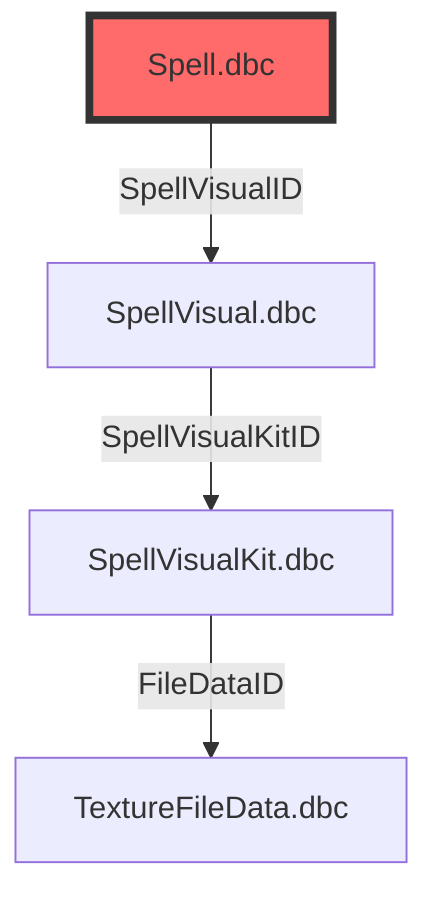

# 🤝 Guide de Contribution

> **Dernière mise à jour** : 2026-09-04  
> **Projet** : Cartographie des Liaisons DBC - World of Warcraft

---

## 📋 Table des Matières

- [Introduction](#-introduction)
- [Code de Conduite](#-code-de-conduite)
- [Comment Contribuer](#-comment-contribuer)
- [Standards de Qualité](#-standards-de-qualité)
- [Types de Contributions](#-types-de-contributions)
- [Processus de Revue](#-processus-de-revue)
- [Reconnaissance](#-reconnaissance)

---

## 🌟 Introduction

Merci de votre intérêt pour contribuer à la cartographie des liaisons DBC de World of Warcraft ! Ce projet vise à documenter de manière exhaustive les relations entre les fichiers DBC pour aider les développeurs, moddeurs et chercheurs.

### Pourquoi Contribuer ?

- 📚 **Partager vos connaissances** sur les DBC
- 🔧 **Améliorer la documentation** pour la communauté
- 🐛 **Corriger les erreurs** existantes
- ✨ **Ajouter de nouvelles découvertes**
- 🌍 **Aider les nouveaux développeurs** à comprendre le système

---

## 📜 Code de Conduite

### Nos Engagements

En tant que membres, contributeurs et dirigeants, nous nous engageons à faire de la participation à notre communauté une expérience sans harcèlement pour tous, quel que soit :

- L'âge
- La taille
- Le handicap visible ou invisible
- L'origine ethnique
- Les caractéristiques sexuelles
- L'identité et l'expression de genre
- Le niveau d'expérience
- L'éducation
- Le statut socio-économique
- La nationalité
- L'apparence personnelle
- La race
- La religion
- L'identité et l'orientation sexuelle

### Nos Normes

**Comportements positifs :**
- ✅ Faire preuve d'empathie et de bienveillance
- ✅ Respecter les opinions différentes
- ✅ Donner et recevoir des critiques constructives
- ✅ Assumer ses responsabilités
- ✅ Se concentrer sur ce qui est le mieux pour la communauté
- ✅ Utiliser un langage inclusif

**Comportements inacceptables :**
- ❌ Le harcèlement sous toutes ses formes
- ❌ Les commentaires discriminatoires
- ❌ Le trollage ou les insultes
- ❌ La publication d'informations privées
- ❌ Toute conduite inappropriée en public ou en privé

---

## 🚀 Comment Contribuer

### Prérequis

Avant de commencer, assurez-vous d'avoir :

- ✅ Un compte GitHub
- ✅ Git installé localement
- ✅ Connaissance de base des DBC WoW
- ✅ Compréhension du format Markdown
- ✅ Notions de Mermaid.js (pour les diagrammes)

### Étapes de Contribution

#### 1. Fork du Projet

```bash
# Visitez https://github.com/votre-username/wow-dbc-mapping
# Cliquez sur le bouton "Fork" en haut à droite
# Cela crée une copie du projet dans votre compte
```

#### 2. Clone du Fork

```bash
# Clonez votre fork en local
git clone https://github.com/VOTRE_USERNAME/wow-dbc-mapping.git
cd wow-dbc-mapping

# Ajoutez le repository original comme remote
git remote add upstream https://github.com/ORIGINAL_OWNER/wow-dbc-mapping.git

# Vérifiez les remotes
git remote -v
```

#### 3. Création d'une Branche

```bash
# Créez une branche pour vos modifications
git checkout -b feature/nouvelle-liaison
# ou
git checkout -b fix/correction-erreur
# ou
git checkout -b docs/amelioration-documentation
```

#### 4. Faire les Modifications

```bash
# Modifiez les fichiers selon les standards
# Consultez la section "Standards de Qualité" ci-dessous

# Vérifiez vos modifications
git status
git diff
```

#### 5. Commit des Changements

```bash
# Ajoutez les fichiers modifiés
git add .

# Créez un commit avec un message descriptif
git commit -m "✨ Ajout liaison Spell.dbc → SpellVisualKit.dbc

- Documentation de la relation
- Ajout d'exemples concrets
- Mise à jour du tableau des liaisons"

# Ou utilisez les emojis conventionnels
git commit -m "🐛 Correction cardinalité ItemSet.dbc → Item.dbc"
```

#### 6. Push vers le Fork

```bash
# Poussez vos modifications
git push origin feature/nouvelle-liaison
```

#### 7. Création d'une Pull Request

1. Visitez votre fork sur GitHub
2. Cliquez sur "Pull Request"
3. Cliquez sur "New Pull Request"
4. Sélectionnez votre branche
5. Remplissez le template de PR
6. Soumettez la PR

#### 8. Synchronisation avec l'Upstream

```bash
# Après l'acceptation de votre PR
git checkout main
git fetch upstream
git merge upstream/main
git push origin main
```

---

## 📏 Standards de Qualité

### Format Markdown

#### Structure des Documents

```markdown
# Titre Principal

> **Dernière mise à jour** : YYYY-MM-DD

## Section

### Sous-section

#### Sous-sous-section

| Tableau | Format |
|---------|--------|
| Cellule | Valeur |
```

#### Tableaux des Liaisons

```markdown
| Source | Champ(s) | Cible | Cardinalité | Description | Exemple Concret |
|--------|----------|-------|-------------|-------------|-----------------|
| `Spell.dbc` | `SpellVisualID` | `SpellVisual.dbc` | N-1 | Association visuelle | Pyroblast → Visual 1234 |
```

#### Schémas Mermaid

````markdown

````

### Conventions de Nommage

#### Branches

| Type | Format | Exemple |
|------|--------|---------|
| Fonctionnalité | `feature/description-courte` | `feature/ajout-liaison-spell` |
| Correction | `fix/description-courte` | `fix/correction-cardinalite` |
| Documentation | `docs/description-courte` | `docs/maj-tableau-liaisons` |
| Amélioration | `improvement/description-courte` | `improvement/schema-dependances` |

#### Commits

| Type | Emoji | Format | Exemple |
|------|-------|--------|---------|
| Fonctionnalité | ✨ | `✨ Description` | `✨ Ajout liaison Spell.dbc → Item.dbc` |
| Correction | 🐛 | `🐛 Description` | `🐛 Correction erreur cardinalité` |
| Documentation | 📝 | `📝 Description` | `📝 Mise à jour du tableau` |
| Amélioration | 🔧 | `🔧 Description` | `🔧 Optimisation des schémas` |
| Nettoyage | 🧹 | `🧹 Description` | `🧹 Suppression fichiers inutiles` |
| Tests | ✅ | `✅ Description` | `✅ Ajout tests de validation` |

#### Dossiers et Fichiers

```
docs/
├── 01-tableau-liaisons.md    # Numérotés pour l'ordre
├── 02-schema-dependances.md
├── 03-analyse-domaines.md
└── 04-cas-particuliers.md

diagrams/
└── dbc-dependencies.mmd      # Nom descriptif en kebab-case

data/
└── dbc-links.csv            # Données structurées
```

### Validation Avant Soumission

#### Checklist de Qualité

- [ ] Les noms de DBC sont corrects (respecter la casse)
- [ ] Les noms de champs sont exacts
- [ ] Les cardinalités sont correctes (1-1, 1-N, N-1, N-N)
- [ ] Les exemples sont vérifiables en jeu
- [ ] Le format Markdown est valide
- [ ] Les tableaux sont bien alignés
- [ ] Les schémas Mermaid fonctionnent
- [ ] Les liens GitHub sont valides
- [ ] Pas de fautes d'orthographe
- [ ] Pas de données sensibles

#### Validation Technique

```bash
# Vérifier la syntaxe Markdown
markdownlint docs/*.md

# Tester les schémas Mermaid
mmdc -i diagrams/dbc-dependencies.mmd -o /tmp/test.png

# Vérifier le CSV
python -c "
import pandas as pd
df = pd.read_csv('data/dbc-links.csv')
print(f'Lignes : {len(df)}')
print(f'Colonnes : {list(df.columns)}')
print(df.head())
"
```

---

## 🎯 Types de Contributions

### 🔧 Corrections

**Ce qui est recherché :**
- Liaisons incorrectes
- Erreurs de cardinalité
- Fautes de frappe
- Schémas erronés
- Données CSV invalides

**Exemple de contribution :**
```markdown
## Correction
- **Avant** : Spell.dbc → SpellVisual.dbc (cardinalité 1-1)
- **Après** : Spell.dbc → SpellVisual.dbc (cardinalité N-1)
- **Raison** : Plusieurs sorts peuvent partager le même visuel
```

### ➕ Ajouts

**Ce qui est recherché :**
- Nouvelles liaisons découvertes
- Exemples supplémentaires
- Documentation de champs
- Cas d'utilisation
- Schémas additionnels

**Exemple de contribution :**
```markdown
## Ajout
- **Nouvelle liaison** : Spell.dbc::EffectSpellID → Spell.dbc (N-1)
- **Description** : Sort déclenché par un autre sort
- **Exemple** : Métamorphose → Aura de métamorphose
```

### 📝 Documentation

**Ce qui est recherché :**
- Clarification des concepts
- Guides d'utilisation
- Tutoriels
- FAQ
- Glossaire

**Exemple de contribution :**
```markdown
## Glossaire
- **DBC** : Database Client, fichier de données du client WoW
- **Cardinalité** : Type de relation entre deux tables
- **Hub** : DBC central avec de nombreuses liaisons
```

### 🔬 Recherche

**Ce qui est recherché :**
- Analyse des champs ambigus
- Découverte de nouvelles relations
- Comparaison entre versions
- Documentation des edge cases
- Tests empiriques

**Exemple de contribution :**
```markdown
## Recherche
- **Champ** : Spell.dbc::Unknown123
- **Hypothèse** : Priorité d'affichage
- **Tests** : 50 sorts testés en jeu
- **Conclusion** : Corrélation avec l'ordre d'affichage
```

### 🛠️ Outils

**Ce qui est recherché :**
- Scripts de validation
- Outils d'analyse
- Convertisseurs
- Extensions
- Automatisation

**Exemple de contribution :**
```python
def validate_dbc_link(source, field, target):
    """Valide une liaison DBC."""
    if source not in dbc_files:
        return f"Erreur : {source} n'existe pas"
    if field not in dbc_fields[source]:
        return f"Erreur : {field} n'existe pas dans {source}"
    if target not in dbc_files:
        return f"Erreur : {target} n'existe pas"
    return "Liaison valide"
```

---

## 🔍 Processus de Revue

### Étapes de Revue

1. **Soumission** : Création de la Pull Request
2. **Validation automatique** : Tests CI/CD
3. **Revue par les mainteneurs** : 1-2 reviewers
4. **Feedback** : Commentaires et suggestions
5. **Modifications** : Ajustements si nécessaire
6. **Approbation** : Validation finale
7. **Merge** : Intégration dans la branche principale

### Critères de Revue

#### Technique
- [ ] Le code/binary est correct
- [ ] La syntaxe est valide
- [ ] Les liens fonctionnent
- [ ] Les schémas se génèrent correctement

#### Contenu
- [ ] Les informations sont exactes
- [ ] Les exemples sont pertinents
- [ ] La documentation est claire
- [ ] Le format est cohérent

#### Qualité
- [ ] Pas de fautes d'orthographe
- [ ] Style cohérent
- [ ] Respect des conventions
- [ ] Documentation complète

### Délais de Revue

| Type de Contribution | Délai Moyen |
|---------------------|-------------|
| Correction simple | 24-48 heures |
| Ajout de liaison | 2-3 jours |
| Documentation | 3-5 jours |
| Recherche | 1-2 semaines |
| Outils | 1-2 semaines |

---

## 🏆 Reconnaissance

### Niveaux de Contributeurs

| Niveau | Critères | Avantages |
|--------|----------|-----------|
| **Contributeur** | 1+ PR acceptée | Mention dans le README |
| **Contributeur Actif** | 5+ PRs acceptées | Accès aux discussions |
| **Mainteneur** | 10+ PRs acceptées | Droits de revue |
| **Core Team** | 20+ PRs acceptées | Droits d'administration |

### Liste des Contributeurs

Les contributeurs sont listés dans le README principal et sur la page GitHub du projet.

### Remerciements Spéciaux

- 🎖️ **Contributeurs exceptionnels** : Mention spéciale dans la documentation
- 🏅 **Découvreurs de liaisons** : Crédité dans les tables
- 📚 **Rédacteurs de documentation** : Cité dans les guides

---

## 📞 Contact

### Canaux de Communication

| Canal | Usage | Lien |
|-------|-------|------|
| **Issues GitHub** | Bugs et suggestions | [Créer une issue](https://github.com/votre-username/wow-dbc-mapping/issues) |
| **Pull Requests** | Contributions | [Créer une PR](https://github.com/votre-username/wow-dbc-mapping/pulls) |
| **Discussions** | Questions générales | [Discussions](https://github.com/votre-username/wow-dbc-mapping/discussions) |
| **Discord** | Chat communautaire | [Rejoindre](https://discord.gg/wowdev) |
| **Email** | Contact privé | [Email](mailto:contact@example.com) |

### Bonnes Pratiques de Communication

- ✅ **Soyez précis** dans vos descriptions
- ✅ **Fournissez des exemples** quand possible
- ✅ **Restez courtois** même en cas de désaccord
- ✅ **Répondez aux questions** des autres
- ✅ **Partagez vos découvertes**

---

## 📚 Ressources Utiles

### Documentation WoW

- [WoW Dev Wiki](https://wowdev.wiki/)
- [TrinityCore Documentation](https://trinitycore.info/)
- [Mangos Documentation](https://github.com/mangos)
- [DBC Documentation](https://wowdev.wiki/DBC)

### Outils

- [WDBX Editor](https://github.com/WowDevTools/WDBXEditor)
- [DBC Viewer](https://github.com/wowdev/DBCViewer)
- [Mermaid Live Editor](https://mermaid.live/)
- [Markdown Guide](https://www.markdownguide.org/)

### Communauté

- [Discord WoW Dev](https://discord.gg/wowdev)
- [Reddit r/wowservers](https://reddit.com/r/wowservers)
- [OwnedCore](https://www.ownedcore.com/forums/)
- [ModCraft](https://modcraft.io/)

---

## ❓ FAQ

### Q : Je ne connais pas bien Git, puis-je contribuer ?
**R :** Oui ! Vous pouvez soumettre des issues avec vos découvertes, et nous les intégrerons.

### Q : Comment trouver de nouvelles liaisons DBC ?
**R :** Utilisez WDBX Editor pour explorer les DBC, ou consultez la documentation existante.

### Q : Puis-je contribuer en français ?
**R :** Oui, le projet accepte les contributions en français et en anglais.

### Q : Les données doivent-elles être parfaites ?
**R :** Non, nous préférons une contribution approximative à pas de contribution du tout.

### Q : Comment devenir mainteneur ?
**R :** Contribuez régulièrement avec des PRs de qualité, et vous serez invité.

---

## 📜 Licence

En contribuant à ce projet, vous acceptez que vos contributions soient sous la licence MIT.

---

*Merci de contribuer à la communauté WoW Dev !* 🎮
