# 🗺️ Schéma des Dépendances DBC

> **Dernière mise à jour** : 2026-09-04  
> **Version WoW** : Retail 11.0.2 | Classic 1.15.4 | WotLK 3.4.3

---

## 📋 Table des Matières

- [Graphe Principal](#graphe-principal)
- [Nœuds Centraux](#nœuds-centraux)
- [Chaînes de Dépendances](#chaînes-de-dépendances)
- [Boucles de Dépendances](#boucles-de-dépendances)
- [Graphes par Domaine](#graphes-par-domaine)
- [Matrice de Dépendances](#matrice-de-dépendances)

---

## Graphe Principal

### Vue Globale des Liaisons DBC

```mermaid
graph TD
    %% ==================== DOMAINE SORTS ====================
    subgraph SORTS["🔮 Domaine Sorts"]
        S[Spell.dbc<br/>Hub Principal]
        SV[SpellVisual.dbc]
        SVK[SpellVisualKit.dbc]
        SI[SpellIcon.dbc]
        SCT[SpellCastTimes.dbc]
        SD[SpellDuration.dbc]
        SR[SpellRange.dbc]
        SC[SpellCooldowns.dbc]
        SCA[SpellCategory.dbc]
        SAO[SpellAuraOptions.dbc]
        SAR[SpellAuraRestrictions.dbc]
        SCR[SpellCastingRequirements.dbc]
        SL[SpellLevels.dbc]
        SM[SpellMissile.dbc]
        SP[SpellPower.dbc]
        SRa[SpellRadius.dbc]
        SSc[SpellScaling.dbc]
        SSh[SpellShapeshift.dbc]
        SDV[SpellDescriptionVariables.dbc]
        SEI[SpellEquippedItems.dbc]
        SInt[SpellInterrupts.dbc]
        SRC[SpellRuneCost.dbc]
        
        S -->|SpellVisualID| SV
        S -->|SpellIconID| SI
        S -->|SpellCastTimeID| SCT
        S -->|SpellDurationID| SD
        S -->|SpellRangeID| SR
        S -->|SpellCooldownsID| SC
        S -->|SpellCategoryID| SCA
        S -->|SpellAuraOptionsID| SAO
        S -->|SpellAuraRestrictionsID| SAR
        S -->|SpellCastingRequirementsID| SCR
        S -->|SpellLevelsID| SL
        S -->|SpellMissileID| SM
        S -->|SpellPowerID| SP
        S -->|SpellRadiusID| SRa
        S -->|SpellScalingID| SSc
        S -->|SpellShapeshiftID| SSh
        S -->|SpellDescriptionVariablesID| SDV
        S -->|SpellEquippedItemsID| SEI
        S -->|SpellInterruptsID| SInt
        S -->|SpellRuneCostID| SRC
        SV -->|SpellVisualKitID| SVK
    end
    
    %% ==================== DOMAINE ITEMS ====================
    subgraph ITEMS["🎒 Domaine Items"]
        I[Item.dbc<br/>Hub Secondaire]
        IDI[ItemDisplayInfo.dbc]
        IS[ItemSet.dbc]
        IRP[ItemRandomProperties.dbc]
        IRS[ItemRandomSuffix.dbc]
        IEC[ItemExtendedCost.dbc]
        IGS[ItemGroupSounds.dbc]
        L[Lock.dbc]
        PTM[PageTextMaterial.dbc]
        
        I -->|DisplayInfoID| IDI
        I -->|ItemSetID| IS
        I -->|RandomPropertiesID| IRP
        I -->|RandomSuffixID| IRS
        I -->|ExtendedCostID| IEC
        I -->|GroupID| IGS
        I -->|LockID| L
        I -->|PageTextID| PTM
    end
    
    %% ==================== DOMAINE CRÉATURES ====================
    subgraph CREATURES["🐉 Domaine Créatures"]
        CID[CreatureDisplayInfo.dbc]
        CMD[CreatureModelData.dbc]
        CSD[CreatureSoundData.dbc]
        CDE[CreatureDisplayInfoExtra.dbc]
        NS[NpcSounds.dbc]
        
        CID -->|ModelID| CMD
        CID -->|SoundID| CSD
        CID -->|ExtraDisplayInfoID| CDE
        CID -->|NPCSoundID| NS
    end
    
    %% ==================== DOMAINE ZONES ====================
    subgraph ZONES["🗺️ Domaine Zones"]
        M[Map.dbc]
        AT[AreaTable.dbc]
        ZM[ZoneMusic.dbc]
        LS[LoadingScreens.dbc]
        FG[FactionGroup.dbc]
        
        M -->|AreaTableID| AT
        M -->|LoadingScreenID| LS
        AT -->|ZoneMusicID| ZM
        AT -->|LoadingScreenID| LS
        AT -->|FactionGroupID| FG
        AT -->|ParentAreaID| AT
    end
    
    %% ==================== DOMAINE COMPÉTENCES ====================
    subgraph SKILLS["📚 Domaine Compétences"]
        SK[SkillLine.dbc]
        SKA[SkillLineAbility.dbc]
        SKC[SkillLineCategory.dbc]
        
        SK -->|CategoryID| SKC
        SK -->|SkillLineID| SKA
        SKA -->|SpellID| S
    end
    
    %% ==================== DOMAINE TALENTS ====================
    subgraph TALENTS["⭐ Domaine Talents"]
        T[Talent.dbc]
        TT[TalentTab.dbc]
        
        T -->|TalentTabID| TT
        T -->|SpellID| S
    end
    
    %% ==================== LIAISONS CROISÉES ====================
    S -->|ReagentID_1..8| I
    S -->|EffectItemID_1..3| I
    I -->|SpellID_1..5| S
    IS -->|ItemID_1..8| I
    IS -->|SetSpellID_1..8| S
    SK -->|IconID| SI
    
    %% ==================== FEUILLES TERMINALES ====================
    subgraph TEXTURES["🖼️ Modèles et Textures"]
        TXT[TextureFileData.dbc<br/>Feuille Terminale]
        MFD[ModelFileData.dbc<br/>Feuille Terminale]
    end
    
    subgraph SONS["🎵 Sons"]
        SE[SoundEntries.dbc]
        SF[SoundFiles.dbc<br/>Feuille Terminale]
    end
    
    SVK -->|FileDataID| TXT
    SVK -->|ModelID_1..3| MFD
    SVK -->|SoundID| SE
    CMD -->|TextureID| TXT
    CMD -->|ModelPathID| MFD
    IDI -->|TextureID_1..10| TXT
    IDI -->|ModelID_1..2| MFD
    IDI -->|SoundID| IGS
    CSD -->|SoundID_1..4| SE
    ZM -->|SoundID_1..2| SE
    SE -->|FileDataID_1..10| SF
    NS -->|SoundID| SE
    
    %% ==================== STYLES ====================
    classDef hub fill:#ff6b6b,stroke:#333,stroke-width:4px,color:#fff
    classDef secondary fill:#ffa502,stroke:#333,stroke-width:3px,color:#fff
    classDef normal fill:#4ecdc4,stroke:#333,stroke-width:2px,color:#333
    classDef terminal fill:#95e1d3,stroke:#333,stroke-width:2px,color:#333
    classDef leaf fill:#f38181,stroke:#333,stroke-width:2px,color:#fff
    
    class S hub
    class I secondary
    class TXT,MFD,SF leaf
    class SV,SVK,SI,SCT,SD,SR,SC,SCA,SAO,SAR,SCR,SL,SM,SP,SRa,SSc,SSh,SDV,SEI,SInt,SRC normal
    class IDI,IS,IRP,IRS,IEC,IGS,L,PTM normal
    class CID,CMD,CSD,CDE,NS normal
    class M,AT,ZM,LS,FG normal
    class SK,SKA,SKC,T,TT normal
    class SE normal
```

---

## Nœuds Centraux

### 🔮 Spell.dbc - Le Hub Principal

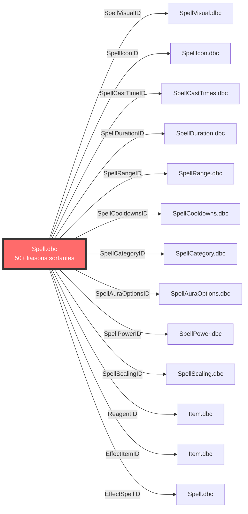

**Caractéristiques :**
- **Liaisons sortantes** : 50+
- **Liaisons entrantes** : 20+ (depuis Item.dbc, Talent.dbc, SkillLineAbility.dbc)
- **Auto-références** : Oui (via EffectSpellID, EffectTriggerSpellID)
- **Rôle** : Définit tous les sorts, compétences et effets du jeu
- **Version** : Présent dans toutes les versions de WoW

### 🎒 Item.dbc - Le Second Hub

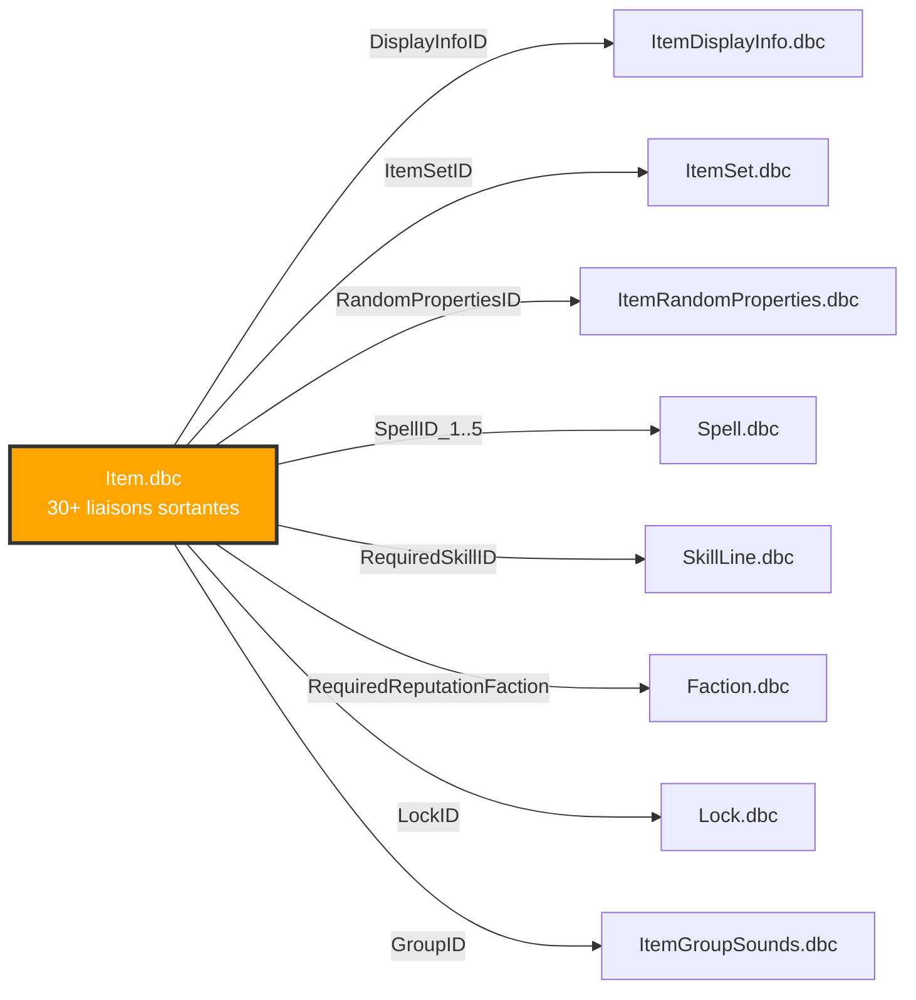

**Caractéristiques :**
- **Liaisons sortantes** : 30+
- **Liaisons entrantes** : 15+ (depuis Spell.dbc, ItemSet.dbc)
- **Auto-références** : Indirectes (via ItemSet.dbc)
- **Rôle** : Définit tous les objets du jeu
- **Version** : Présent dans toutes les versions de WoW

---

## Chaînes de Dépendances

### Chaîne Visuelle d'un Sort

```mermaid
graph LR
    A[Spell.dbc<br/>Sort] -->|SpellVisualID| B[SpellVisual.dbc<br/>Visuel]
    B -->|SpellVisualKitID| C[SpellVisualKit.dbc<br/>Kit Visuel]
    C -->|FileDataID| D[TextureFileData.dbc<br/>Texture]
    D -->|Chemin| E[Fichier .blp<br/>sur disque]
    
    C -->|ModelID| F[ModelFileData.dbc<br/>Modèle]
    F -->|Chemin| G[Fichier .m2<br/>sur disque]
    
    C -->|SoundID| H[SoundEntries.dbc<br/>Son]
    H -->|FileDataID| I[SoundFiles.dbc<br/>Fichier Audio]
    I -->|Chemin| J[Fichier .ogg<br/>sur disque]
    
    classDef start fill:#ff6b6b,stroke:#333,stroke-width:3px,color:#fff
    classDef mid fill:#4ecdc4,stroke:#333,stroke-width:2px
    classDef end fill:#95e1d3,stroke:#333,stroke-width:2px
    
    class A start
    class B,C,H mid
    class D,F,I end
```

**Exemple concret :** Boule de feu (Spell ID 133)
1. **Spell.dbc** → SpellVisualID = 542 (projectile de feu)
2. **SpellVisual.dbc** → SpellVisualKitID = 123 (kit de projectile)
3. **SpellVisualKit.dbc** → FileDataID = 4567 (texture de feu)
4. **TextureFileData.dbc** → "Spells/Fireball/Fireball.blp"

### Chaîne d'un Item

```mermaid
graph LR
    A[Item.dbc<br/>Item] -->|DisplayInfoID| B[ItemDisplayInfo.dbc<br/>Apparence]
    B -->|ModelID| C[ModelFileData.dbc<br/>Modèle 3D]
    B -->|TextureID| D[TextureFileData.dbc<br/>Textures]
    B -->|IconID| E[ItemDisplayInfo.dbc<br/>Icône]
    
    C -->|Chemin| F[Fichier .m2<br/>sur disque]
    D -->|Chemin| G[Fichier .blp<br/>sur disque]
    
    classDef start fill:#ffa502,stroke:#333,stroke-width:3px,color:#fff
    classDef mid fill:#4ecdc4,stroke:#333,stroke-width:2px
    classDef end fill:#95e1d3,stroke:#333,stroke-width:2px
    
    class A start
    class B,C,D,E mid
    class F,G end
```

**Exemple concret :** Épée runique (Item ID 12345)
1. **Item.dbc** → DisplayInfoID = 678 (apparence d'épée)
2. **ItemDisplayInfo.dbc** → ModelID = 890 (modèle d'épée)
3. **ModelFileData.dbc** → "Item/Object/Weapon/Sword.m2"

### Chaîne d'une Créature

```mermaid
graph LR
    A[CreatureDisplayInfo.dbc<br/>Apparence] -->|ModelID| B[CreatureModelData.dbc<br/>Modèle]
    A -->|TextureID| C[TextureFileData.dbc<br/>Textures]
    A -->|SoundID| D[CreatureSoundData.dbc<br/>Sons]
    
    B -->|ModelPathID| E[ModelFileData.dbc<br/>Fichier Modèle]
    C -->|Chemin| F[Fichier .blp<br/>sur disque]
    D -->|SoundID_1..4| G[SoundEntries.dbc<br/>Entrées Son]
    G -->|FileDataID| H[SoundFiles.dbc<br/>Fichiers Audio]
    
    classDef start fill:#a29bfe,stroke:#333,stroke-width:3px,color:#fff
    classDef mid fill:#4ecdc4,stroke:#333,stroke-width:2px
    classDef end fill:#95e1d3,stroke:#333,stroke-width:2px
    
    class A start
    class B,C,D,G mid
    class E,F,H end
```

### Chaîne d'une Zone

```mermaid
graph LR
    A[Map.dbc<br/>Continent] -->|AreaTableID| B[AreaTable.dbc<br/>Zone]
    B -->|ZoneMusicID| C[ZoneMusic.dbc<br/>Musique]
    B -->|LoadingScreenID| D[LoadingScreens.dbc<br/>Écran]
    B -->|ParentAreaID| E[AreaTable.dbc<br/>Zone Parente]
    
    C -->|SoundID| F[SoundEntries.dbc<br/>Son]
    F -->|FileDataID| G[SoundFiles.dbc<br/>Fichier Audio]
    
    classDef start fill:#55efc4,stroke:#333,stroke-width:3px
    classDef mid fill:#4ecdc4,stroke:#333,stroke-width:2px
    classDef end fill:#95e1d3,stroke:#333,stroke-width:2px
    
    class A start
    class B,C,D,E,F mid
    class G end
```

---

## Boucles de Dépendances

### Boucle Spell ↔ Item (Relation Circulaire)

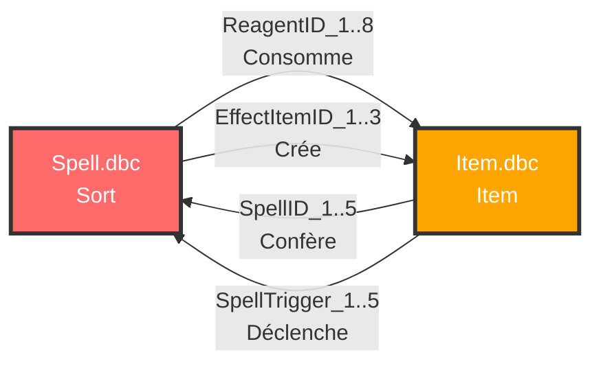

**Explication :**
- Un sort peut consommer un item (reagent)
- Un sort peut créer un item (effect)
- Un item peut conférer un sort (proc)
- Cette boucle est **essentielle** pour le gameplay

**Exemple concret :**
- **Potion de soins** (Item) → Confère **Soins** (Spell)
- **Alchimie** (Spell) → Crée **Potion de soins** (Item)

### Boucle Spell ↔ Talent

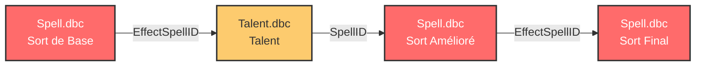

**Exemple concret :**
- **Boule de feu** (Spell de base) → **Amélioration Boule de feu** (Talent) → **Boule de feu améliorée** (Spell)

### Auto-référence Spell (Sorts en Chaîne)

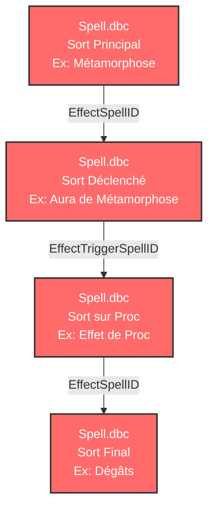

### Auto-référence AreaTable (Hiérarchie de Zones)

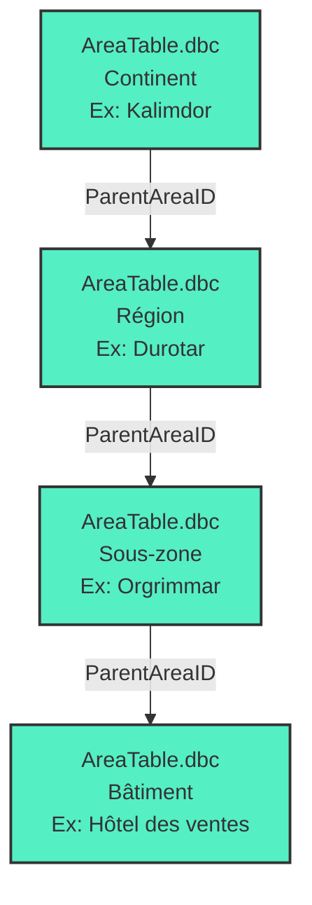

---

## Graphes par Domaine

### 🔮 Domaine Sorts - Vue Détaillée

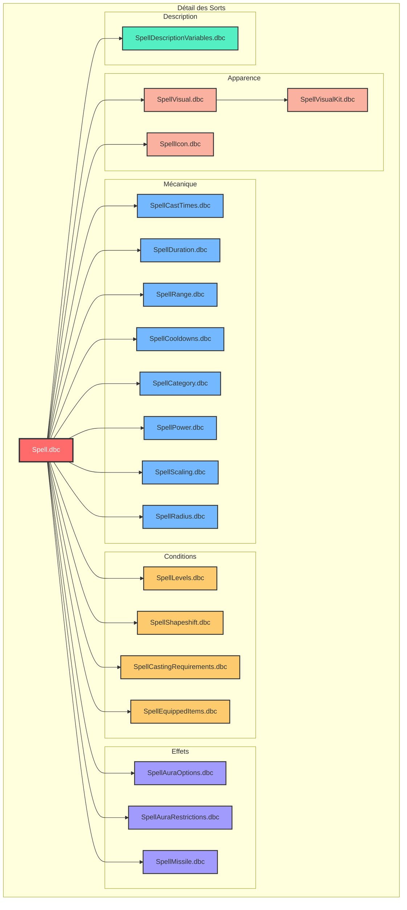

### 🎒 Domaine Items - Vue Détaillée

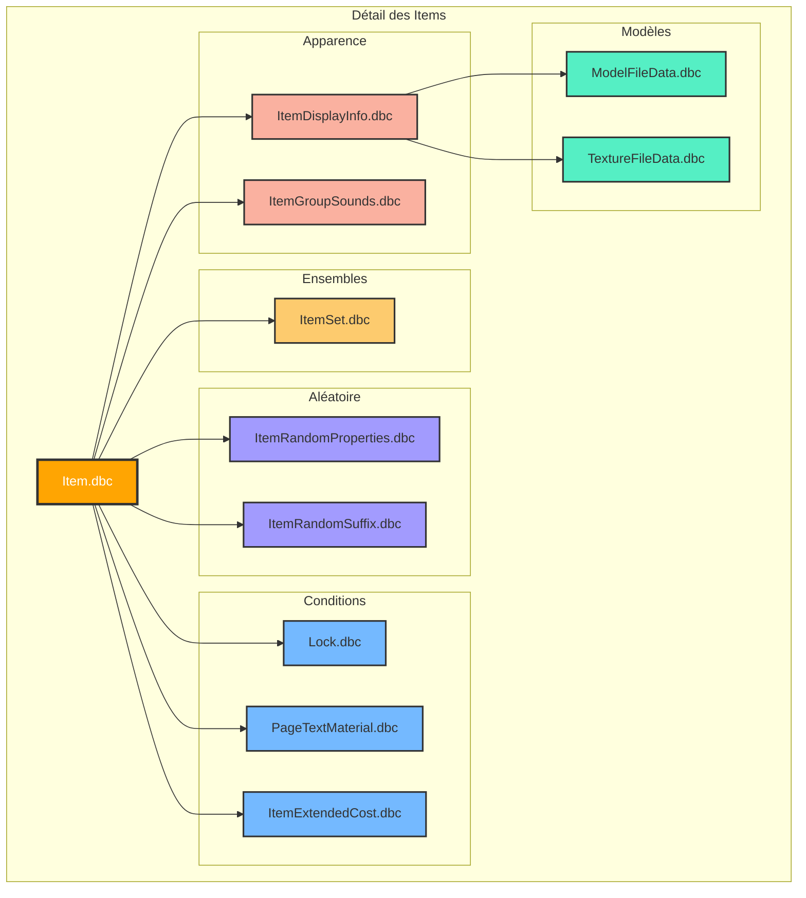

### 🐉 Domaine Créatures - Vue Détaillée

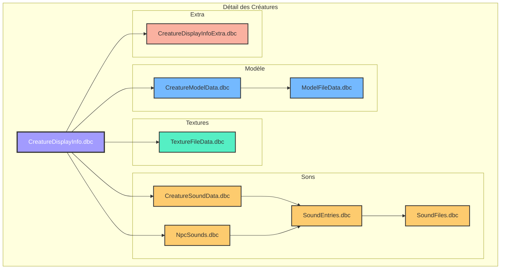

### 🗺️ Domaine Zones - Vue Détaillée

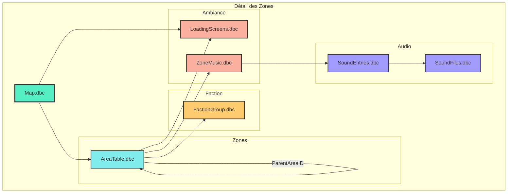

---

## Matrice de Dépendances

### Matrice Complète des Liaisons

| Source \ Cible | Spell.dbc | Item.dbc | SpellVisual.dbc | ItemDisplayInfo.dbc | CreatureDisplayInfo.dbc | Map.dbc | AreaTable.dbc | TextureFileData.dbc | ModelFileData.dbc | SoundEntries.dbc |
|----------------|-----------|----------|-----------------|---------------------|-------------------------|---------|---------------|---------------------|-------------------|------------------|
| **Spell.dbc** | ✅ | ✅ | ✅ | ❌ | ❌ | ❌ | ❌ | ❌ | ❌ | ❌ |
| **Item.dbc** | ✅ | ❌ | ❌ | ✅ | ❌ | ❌ | ❌ | ❌ | ❌ | ❌ |
| **SpellVisual.dbc** | ❌ | ❌ | ❌ | ❌ | ❌ | ❌ | ❌ | ❌ | ❌ | ❌ |
| **SpellVisualKit.dbc** | ❌ | ❌ | ❌ | ❌ | ❌ | ❌ | ❌ | ✅ | ✅ | ✅ |
| **ItemDisplayInfo.dbc** | ❌ | ❌ | ❌ | ❌ | ❌ | ❌ | ❌ | ✅ | ✅ | ❌ |
| **CreatureDisplayInfo.dbc** | ❌ | ❌ | ❌ | ❌ | ❌ | ❌ | ❌ | ✅ | ✅ | ✅ |
| **Map.dbc** | ❌ | ❌ | ❌ | ❌ | ❌ | ❌ | ✅ | ❌ | ❌ | ❌ |
| **AreaTable.dbc** | ❌ | ❌ | ❌ | ❌ | ❌ | ❌ | ✅ | ❌ | ❌ | ✅ |
| **SkillLineAbility.dbc** | ✅ | ❌ | ❌ | ❌ | ❌ | ❌ | ❌ | ❌ | ❌ | ❌ |
| **Talent.dbc** | ✅ | ❌ | ❌ | ❌ | ❌ | ❌ | ❌ | ❌ | ❌ | ❌ |

### Légende de la Matrice

- ✅ = Liaison directe
- ❌ = Pas de liaison directe
- 🔄 = Liaison bidirectionnelle
- 🔗 = Liaison indirecte (via un DBC intermédiaire)

---

## Statistiques des Dépendances

### Répartition par Type de Liaison

| Type de Liaison | Nombre | Exemple |
|-----------------|--------|---------|
| **N-1** | 65 | Spell.dbc → SpellVisual.dbc |
| **1-N** | 15 | Map.dbc → AreaTable.dbc |
| **N-N** | 15 | Spell.dbc ↔ Item.dbc |
| **1-1** | 5 | Spell.dbc → SpellDescriptionVariables.dbc |

### Profondeur des Chaînes

| Chaîne | Profondeur | Étapes |
|--------|------------|--------|
| Spell → Texture | 3 | Spell → Visual → Kit → Texture |
| Item → Modèle | 3 | Item → DisplayInfo → ModelData → Modèle |
| Creature → Son | 4 | Creature → SoundData → SoundEntries → SoundFiles |
| Map → Musique | 4 | Map → AreaTable → ZoneMusic → SoundEntries → SoundFiles |

### DBC Feuilles (Sans Dépendances Sortantes)

| DBC Feuille | Type |
|-------------|------|
| `TextureFileData.dbc` | Texture |
| `ModelFileData.dbc` | Modèle 3D |
| `SoundFiles.dbc` | Audio |
| `SpellIcon.dbc` | Icône |
| `LoadingScreens.dbc` | Image |

---

## Notes d'Utilisation

### 📊 Comment Lire les Schémas

1. **Flèches** : Indiquent la direction de la dépendance
2. **Couleurs** :
   - 🔴 Rouge : Hub principal (Spell.dbc)
   - 🟠 Orange : Hub secondaire (Item.dbc)
   - 🟢 Vert : Feuille terminale (Textures, Modèles)
   - 🔵 Bleu : DBC normaux
3. **Sous-graphes** : Regroupent les DBC par domaine fonctionnel

### 🔍 Points d'Attention

1. **Spell.dbc** est le point de départ de la plupart des chaînes
2. **TextureFileData.dbc** est souvent la fin des chaînes
3. **Les boucles** Spell ↔ Item sont essentielles au gameplay
4. **Les auto-références** créent des hiérarchies (zones, sorts)

### 🛠️ Outils Recommandés

- **Visualisation interactive** : Utiliser Mermaid Live Editor
- **Export PNG** : `mmdc -i schema.mmd -o schema.png -t dark`
- **Documentation** : GitHub supporte nativement Mermaid

---

*Documentation générée le 4 septembre 2026 - Version 1.0*
