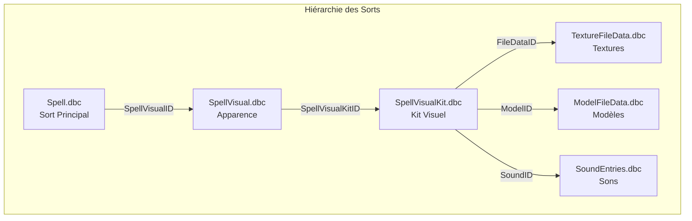
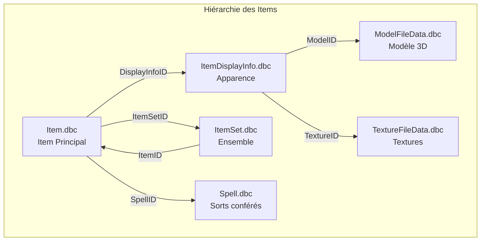
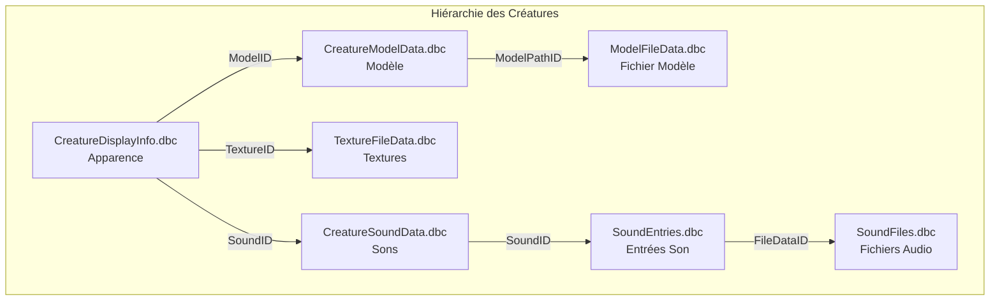
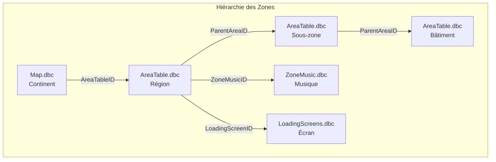
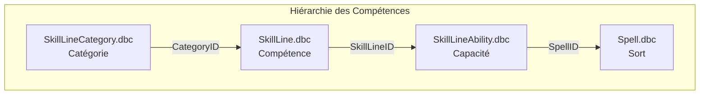
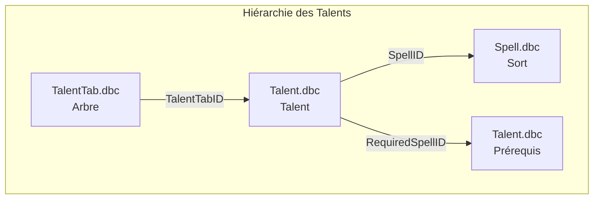
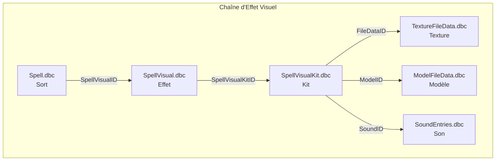
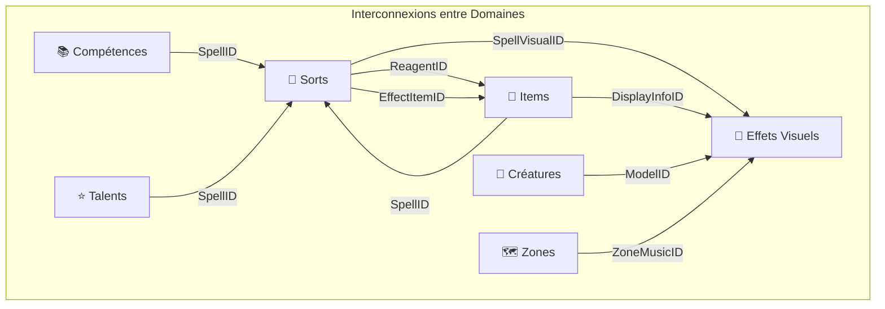

# 🔎 Analyse par Domaine Fonctionnel

> **Dernière mise à jour** : 2026-09-04  
> **Version WoW** : Retail 11.0.2 | Classic 1.15.4 | WotLK 3.4.3

---

## 📋 Table des Matières

- [Domaine Sorts](#-domaine-sorts)
- [Domaine Items](#-domaine-items)
- [Domaine Créatures](#-domaine-créatures)
- [Domaine Zones et Cartes](#-domaine-zones-et-cartes)
- [Domaine Compétences](#-domaine-compétences)
- [Domaine Talents](#-domaine-talents)
- [Domaine Effets Visuels](#-domaine-effets-visuels)
- [Analyse Transversale](#-analyse-transversale)

---

## 🔮 Domaine Sorts

### Vue d'Ensemble

Le domaine des sorts est le plus complexe et le plus interconnecté de tout le système DBC. Il constitue le cœur du gameplay de World of Warcraft.

### DBC Principaux

| DBC | Rôle | Importance | Liaisons |
|-----|------|------------|----------|
| `Spell.dbc` | Définition centrale de tous les sorts | ⭐⭐⭐⭐⭐ | 50+ sortantes |
| `SpellVisual.dbc` | Apparence visuelle des sorts | ⭐⭐⭐⭐ | 10+ sortantes |
| `SpellVisualKit.dbc` | Kits visuels détaillés | ⭐⭐⭐⭐ | 8+ sortantes |
| `SpellIcon.dbc` | Icônes des sorts | ⭐⭐⭐ | 0 sortantes |
| `SpellCastTimes.dbc` | Temps d'incantation | ⭐⭐⭐ | 0 sortantes |
| `SpellDuration.dbc` | Durée des effets | ⭐⭐⭐ | 0 sortantes |
| `SpellRange.dbc` | Portée des sorts | ⭐⭐⭐ | 0 sortantes |
| `SpellCooldowns.dbc` | Temps de recharge | ⭐⭐⭐ | 0 sortantes |
| `SpellCategory.dbc` | Catégories de cooldown | ⭐⭐ | 0 sortantes |
| `SpellPower.dbc` | Puissance des effets | ⭐⭐⭐⭐ | 0 sortantes |
| `SpellScaling.dbc` | Échelle de dégâts | ⭐⭐⭐⭐ | 0 sortantes |
| `SpellRadius.dbc` | Rayon d'effet de zone | ⭐⭐⭐ | 0 sortantes |
| `SpellShapeshift.dbc` | Formes animales | ⭐⭐ | 0 sortantes |
| `SpellLevels.dbc` | Niveaux requis | ⭐⭐ | 0 sortantes |
| `SpellMissile.dbc` | Projectiles | ⭐⭐ | 0 sortantes |
| `SpellAuraOptions.dbc` | Options d'aura | ⭐⭐⭐ | 0 sortantes |
| `SpellAuraRestrictions.dbc` | Restrictions d'aura | ⭐⭐ | 0 sortantes |
| `SpellCastingRequirements.dbc` | Conditions d'incantation | ⭐⭐ | 0 sortantes |
| `SpellDescriptionVariables.dbc` | Variables de description | ⭐ | 0 sortantes |
| `SpellEquippedItems.dbc` | Items requis équipés | ⭐ | 0 sortantes |
| `SpellInterrupts.dbc` | Comportement d'interruption | ⭐ | 0 sortantes |
| `SpellRuneCost.dbc` | Coût en runes (DK) | ⭐ | 0 sortantes |

### Hiérarchie des Sorts



### Liaisons Internes

Un sort (`Spell.dbc`) pointe vers de nombreux DBC de configuration :

1. **Apparence** : `SpellVisual.dbc` → `SpellVisualKit.dbc`
2. **Mécanique** : Temps, durée, portée, cooldown
3. **Effets** : Auras, projectiles, puissance
4. **Conditions** : Niveaux, formes, équipement

### Liaisons Externes

| Vers | Via | Type | Exemple |
|------|-----|------|---------|
| **Items** | `ReagentID_1..8` | N-N | Portail consomme une pierre |
| **Items** | `EffectItemID_1..3` | N-N | Invocation crée un item |
| **Compétences** | `SkillLineAbility.dbc` | N-1 | Recette apprise |
| **Talents** | `Talent.dbc` | N-1 | Sort amélioré |
| **Sorts** | `EffectSpellID_1..3` | N-1 | Sort déclenché |

### Exemples Concrets

#### Sort Simple (Boule de Feu)

```
Spell.dbc (ID: 133)
├── SpellVisualID → 542 (projectile de feu)
├── SpellIconID → 188
├── SpellCastTimeID → 35 (3.5 secondes)
├── SpellRangeID → 1 (40 mètres)
├── SpellCooldownsID → 0 (pas de cooldown)
├── SpellPowerID → 214 (dégâts de base)
└── SpellScalingID → 145 (échelle)
```

#### Sort Complexe (Métamorphose)

```
Spell.dbc (ID: 5484)
├── SpellVisualID → 1234 (transformation)
├── SpellDurationID → 45 (30 secondes)
├── SpellCooldownsID → 87 (3 minutes)
├── EffectSpellID_1 → 5485 (aura de métamorphose)
├── EffectSpellID_2 → 5486 (bonus de dégâts)
└── SpellShapeshiftID → 2 (forme de démon)
```

### Statistiques du Domaine

| Métrique | Valeur |
|----------|--------|
| Nombre total de sorts | 50,000+ (toutes versions) |
| Sorts avec visuel | 80% |
| Sorts avec cooldown | 40% |
| Sorts avec reagent | 15% |
| Sorts auto-référencés | 10% |

---

## 🎒 Domaine Items

### Vue d'Ensemble

Le domaine des items est le second plus important, avec des liaisons vers les sorts, les compétences et les factions.

### DBC Principaux

| DBC | Rôle | Importance | Liaisons |
|-----|------|------------|----------|
| `Item.dbc` | Définition centrale des objets | ⭐⭐⭐⭐⭐ | 30+ sortantes |
| `ItemDisplayInfo.dbc` | Apparence des items | ⭐⭐⭐⭐ | 10+ sortantes |
| `ItemSet.dbc` | Ensembles d'items | ⭐⭐⭐ | 15+ sortantes |
| `ItemRandomProperties.dbc` | Propriétés aléatoires | ⭐⭐ | 5+ sortantes |
| `ItemRandomSuffix.dbc` | Suffixes aléatoires | ⭐⭐ | 3+ sortantes |
| `ItemExtendedCost.dbc` | Coûts étendus | ⭐⭐ | 0 sortantes |
| `ItemGroupSounds.dbc` | Sons des items | ⭐⭐ | 0 sortantes |
| `Lock.dbc` | Mécanismes de verrouillage | ⭐ | 0 sortantes |
| `PageTextMaterial.dbc` | Textes de pages | ⭐ | 0 sortantes |

### Hiérarchie des Items



### Liaisons Internes

Un item pointe vers :
1. **Apparence** : `ItemDisplayInfo.dbc`
2. **Ensemble** : `ItemSet.dbc`
3. **Aléatoire** : `ItemRandomProperties.dbc`, `ItemRandomSuffix.dbc`

### Liaisons Externes

| Vers | Via | Type | Exemple |
|------|-----|------|---------|
| **Sorts** | `SpellID_1..5` | N-N | Cœur confère Fureur |
| **Factions** | `RequiredReputationFaction` | N-1 | Épée du croisé |
| **Compétences** | `RequiredSkillID` | N-1 | Minerai → Minage |
| **Sorts** | `ItemSet.dbc::SetSpellID` | N-N | Bonus d'ensemble |

### Types d'Items

| Type | Description | Exemple | Liaisons Spécifiques |
|------|-------------|---------|---------------------|
| **Armes** | Épées, haches, bâtons | Ashbringer | ModelID, SoundID |
| **Armures** | Casques, plastrons | Heaume de Tranche-Mort | ItemSetID |
| **Consommables** | Potions, nourriture | Potion de soins | SpellID (effet) |
| **Composants** | Minerais, herbes | Minerai de thorium | RequiredSkillID |
| **Conteneurs** | Sacs, boîtes | Sac de voyageur | ContainerSlots |
| **Clés** | Clés de donjon | Clé de Scholomance | LockID |
| **Montures** | Chevaux, dragons | Cheval de guerre | SpellID (invocation) |
| **Jouets** | Objets amusants | Boîte à musique | SpellID (effet) |

### Exemples Concrets

#### Item Simple (Potion de Soins)

```
Item.dbc (ID: 118)
├── DisplayInfoID → 234 (flacon rouge)
├── SpellID_1 → 439 (soins)
├── SpellTrigger_1 → 0 (à l'utilisation)
├── RequiredLevel → 1
└── BuyPrice → 40 (4 pièces d'argent)
```

#### Item Complexe (Ashbringer)

```
Item.dbc (ID: 13262)
├── DisplayInfoID → 5678 (modèle unique)
├── ItemSetID → 0 (pas d'ensemble)
├── SpellID_1 → 25771 (bonus de dégâts)
├── RequiredLevel → 60
├── RequiredReputationFaction → 0 (pas de réputation)
└── ItemLevel → 74
```

### Statistiques du Domaine

| Métrique | Valeur |
|----------|--------|
| Nombre total d'items | 30,000+ |
| Items avec sort | 25% |
| Items en ensemble | 10% |
| Items avec réputation | 5% |
| Items avec compétence requise | 20% |

---

## 🐉 Domaine Créatures

### Vue d'Ensemble

Le domaine des créatures gère l'apparence, les modèles et les sons des créatures du jeu.

### DBC Principaux

| DBC | Rôle | Importance | Liaisons |
|-----|------|------------|----------|
| `CreatureDisplayInfo.dbc` | Apparence des créatures | ⭐⭐⭐⭐⭐ | 10+ sortantes |
| `CreatureModelData.dbc` | Modèles 3D | ⭐⭐⭐⭐ | 5+ sortantes |
| `CreatureSoundData.dbc` | Sons des créatures | ⭐⭐⭐ | 5+ sortantes |
| `CreatureDisplayInfoExtra.dbc` | Apparences supplémentaires | ⭐⭐ | 3+ sortantes |
| `NpcSounds.dbc` | Sons des PNJ | ⭐⭐ | 2+ sortantes |

### Hiérarchie des Créatures



### Liaisons Internes

`CreatureDisplayInfo.dbc` sert de pont entre :
1. **Modèle** : `CreatureModelData.dbc` → `ModelFileData.dbc`
2. **Textures** : `TextureFileData.dbc`
3. **Sons** : `CreatureSoundData.dbc` → `SoundEntries.dbc`

### Liaisons Externes

| Vers | Via | Type | Exemple |
|------|-----|------|---------|
| **Sorts** | Base de données serveur | Indirect | Créature lance un sort |
| **Zones** | Table de spawn | Indirect | Créature dans une zone |
| **Quêtes** | Base de données serveur | Indirect | PNJ de quête |

### Types de Créatures

| Type | Description | Exemple | Spécificités |
|------|-------------|---------|--------------|
| **PNJ** | Personnages non-joueurs | Vendeurs, gardes | NPCSoundID |
| **Monstres** | Ennemis à combattre | Murlocs, dragons | CombatSounds |
| **Boss** | Ennemis puissants | Ragnaros, Onyxia | Modèles uniques |
| **Créatures passives** | Animaux, critiques | Cerfs, lapins | Sons simples |
| **Montures** | Créatures chevauchables | Chevaux, griffons | MountHeight |

### Exemples Concrets

#### Créature Simple (Murloc)

```
CreatureDisplayInfo.dbc (ID: 486)
├── ModelID → 1234 (modèle de murloc)
├── TextureID_1 → 5678 (peau verte)
├── SoundID → 789 (cri de murloc)
└── CreatureModelScale → 1.0
```

#### Créature Complexe (Ragnaros)

```
CreatureDisplayInfo.dbc (ID: 1223)
├── ModelID → 4567 (géant de feu)
├── TextureID_1 → 8901 (lave)
├── TextureID_2 → 8902 (feu)
├── SoundID → 2345 (rugissement)
├── ExtraDisplayInfoID → 678 (particules de feu)
└── CreatureModelScale → 2.5
```

### Statistiques du Domaine

| Métrique | Valeur |
|----------|--------|
| Nombre total de créatures | 20,000+ |
| Créatures avec sons | 60% |
| Créatures avec textures multiples | 30% |
| Boss avec modèles uniques | 100% |

---

## 🗺️ Domaine Zones et Cartes

### Vue d'Ensemble

Le domaine des zones définit la géographie du jeu et son ambiance.

### DBC Principaux

| DBC | Rôle | Importance | Liaisons |
|-----|------|------------|----------|
| `Map.dbc` | Continents et instances | ⭐⭐⭐⭐⭐ | 5+ sortantes |
| `AreaTable.dbc` | Zones et sous-zones | ⭐⭐⭐⭐⭐ | 10+ sortantes |
| `ZoneMusic.dbc` | Musique d'ambiance | ⭐⭐⭐ | 5+ sortantes |
| `LoadingScreens.dbc` | Écrans de chargement | ⭐⭐ | 0 sortantes |
| `FactionGroup.dbc` | Groupes de factions | ⭐⭐ | 0 sortantes |

### Hiérarchie des Zones



### Liaisons Internes

`Map.dbc` contient les continents. `AreaTable.dbc` liste les zones et les lie à une carte via `ParentAreaID`.

### Liaisons Externes

| Vers | Via | Type | Exemple |
|------|-----|------|---------|
| **Quêtes** | Base de données serveur | Indirect | Quête dans une zone |
| **Items** | Base de données serveur | Indirect | Item de zone |
| **Créatures** | Table de spawn | Indirect | Créature dans une zone |

### Types de Zones

| Type | Description | Exemple | Spécificités |
|------|-------------|---------|--------------|
| **Continents** | Grandes masses terrestres | Kalimdor, Royaumes de l'Est | MapType 0 |
| **Régions** | Zones majeures | Durotar, Elwynn | ParentAreaID |
| **Sous-zones** | Zones secondaires | Orgrimmar, Hurlevent | ParentAreaID |
| **Bâtiments** | Intérieurs | Hôtel des ventes | ParentAreaID |
| **Instances** | Donjons et raids | Scholomance, Molten Core | MapType 1 |
| **Battlegrounds** | Champs de bataille | Alterac, Warsong | MapType 2 |

### Exemples Concrets

#### Zone Simple (Durotar)

```
AreaTable.dbc (ID: 14)
├── MapID → 1 (Kalimdor)
├── ParentAreaID → 1 (Kalimdor)
├── ZoneMusicID → 123 (musique de Durotar)
├── LoadingScreenID → 456 (écran de Durotar)
└── FactionGroupID → 1 (Horde)
```

#### Zone Complexe (Orgrimmar)

```
AreaTable.dbc (ID: 1637)
├── MapID → 1 (Kalimdor)
├── ParentAreaID → 14 (Durotar)
├── ZoneMusicID → 789 (musique d'Orgrimmar)
├── LoadingScreenID → 234 (écran d'Orgrimmar)
└── FactionGroupID → 1 (Horde)
```

### Statistiques du Domaine

| Métrique | Valeur |
|----------|--------|
| Nombre total de cartes | 100+ |
| Nombre total de zones | 500+ |
| Zones avec musique | 80% |
| Zones avec écran de chargement | 60% |
| Hiérarchie maximale | 4 niveaux |

---

## 📚 Domaine Compétences

### Vue d'Ensemble

Les compétences définissent les métiers et les capacités apprises par les joueurs.

### DBC Principaux

| DBC | Rôle | Importance | Liaisons |
|-----|------|------------|----------|
| `SkillLine.dbc` | Compétences | ⭐⭐⭐⭐ | 5+ sortantes |
| `SkillLineAbility.dbc` | Capacités des compétences | ⭐⭐⭐⭐ | 10+ sortantes |
| `SkillLineCategory.dbc` | Catégories de compétences | ⭐⭐ | 0 sortantes |

### Hiérarchie des Compétences



### Types de Compétences

| Type | Description | Exemple |
|------|-------------|---------|
| **Métiers principaux** | Alchimie, Forge | 2 maximum |
| **Métiers secondaires** | Cuisine, Pêche | Illimité |
| **Compétences d'arme** | Épées, Haches | Selon classe |
| **Compétences de classe** | Crochetage, Ambidextrie | Spécifique |

### Exemples Concrets

#### Compétence Simple (Minage)

```
SkillLine.dbc (ID: 186)
├── CategoryID → 11 (métier)
├── IconID → 345
└── SkillLineAbility.dbc
    ├── SpellID → 2575 (fondre)
    ├── SpellID → 2576 (extraire)
    └── SpellID → 3564 (thorium)
```

---

## ⭐ Domaine Talents

### Vue d'Ensemble

Les talents permettent de personnaliser les capacités des personnages.

### DBC Principaux

| DBC | Rôle | Importance | Liaisons |
|-----|------|------------|----------|
| `Talent.dbc` | Talents | ⭐⭐⭐⭐ | 10+ sortantes |
| `TalentTab.dbc` | Arbres de talents | ⭐⭐⭐ | 5+ sortantes |

### Hiérarchie des Talents



### Exemples Concrets

#### Talent Simple (Peau de Givre)

```
Talent.dbc (ID: 123)
├── TalentTabID → 1 (Élémentaire)
├── SpellID → 456 (sort amélioré)
├── RequiredSpellID → 789 (sort de base)
└── Rank_1..5 → 3 rangs
```

---

## 🎨 Domaine Effets Visuels

### Vue d'Ensemble

Les effets visuels enrichissent l'expérience de jeu avec des particules, des modèles et des sons.

### DBC Principaux

| DBC | Rôle | Importance | Liaisons |
|-----|------|------------|----------|
| `SpellVisual.dbc` | Effets visuels des sorts | ⭐⭐⭐⭐ | 5+ sortantes |
| `SpellVisualKit.dbc` | Kits d'effets | ⭐⭐⭐⭐ | 10+ sortantes |
| `ParticleColor.dbc` | Couleurs des particules | ⭐⭐ | 0 sortantes |

### Chaîne d'Effet Visuel



---

## 🔄 Analyse Transversale

### Interconnexions entre Domaines



### Flux de Données

| Origine | Destination | Type de Flux | Fréquence |
|---------|-------------|--------------|-----------|
| Sorts | Items | Création/Consommation | Élevée |
| Items | Sorts | Confération | Élevée |
| Compétences | Sorts | Apprentissage | Moyenne |
| Talents | Sorts | Amélioration | Moyenne |
| Tous | Visuels | Rendu | Très élevée |

### Points de Convergence

1. **Spell.dbc** : Point de convergence principal
2. **TextureFileData.dbc** : Fin de chaîne commune
3. **SoundEntries.dbc** : Convergence audio
4. **ModelFileData.dbc** : Convergence des modèles

### Statistiques Globales

| Métrique | Valeur |
|----------|--------|
| Total des DBC analysés | 50+ |
| Total des liaisons | 150+ |
| Domaines principaux | 7 |
| DBC hubs | 2 (Spell, Item) |
| DBC feuilles | 5 (Textures, Modèles, Sons) |

---

## 📝 Conclusions par Domaine

### 🔮 Sorts
- **Complexité** : Très élevée
- **Interconnexions** : Nombreuses
- **Maintenance** : Critique
- **Points sensibles** : SpellVisual, SpellPower

### 🎒 Items
- **Complexité** : Élevée
- **Interconnexions** : Moyennes
- **Maintenance** : Importante
- **Points sensibles** : ItemDisplayInfo, ItemSet

### 🐉 Créatures
- **Complexité** : Moyenne
- **Interconnexions** : Faibles
- **Maintenance** : Modérée
- **Points sensibles** : CreatureModelData

### 🗺️ Zones
- **Complexité** : Moyenne
- **Interconnexions** : Faibles
- **Maintenance** : Modérée
- **Points sensibles** : AreaTable, ZoneMusic

### 📚 Compétences
- **Complexité** : Faible
- **Interconnexions** : Moyennes
- **Maintenance** : Simple
- **Points sensibles** : SkillLineAbility

### ⭐ Talents
- **Complexité** : Faible
- **Interconnexions** : Moyennes
- **Maintenance** : Simple
- **Points sensibles** : Talent, TalentTab

### 🎨 Effets Visuels
- **Complexité** : Élevée
- **Interconnexions** : Nombreuses
- **Maintenance** : Importante
- **Points sensibles** : SpellVisualKit

---

## 🔧 Recommandations

### Pour les Développeurs
1. **Commencer par Spell.dbc** pour comprendre les liaisons
2. **Suivre les chaînes** jusqu'aux feuilles terminales
3. **Documenter les cas particuliers** rencontrés
4. **Tester les modifications** sur un serveur local

### Pour les Moddeurs
1. **Utiliser les bons IDs** dans les DBC
2. **Vérifier les cardinalités** avant modification
3. **Créer des sauvegardes** des DBC originaux
4. **Tester les changements** en jeu

### Pour les Contributeurs
1. **Se concentrer sur un domaine** à la fois
2. **Vérifier les liaisons** avec des exemples concrets
3. **Documenter les ambiguïtés** rencontrées
4. **Partager les découvertes** avec la communauté

---

*Analyse générée le 4 septembre 2026 - Version 1.0*
