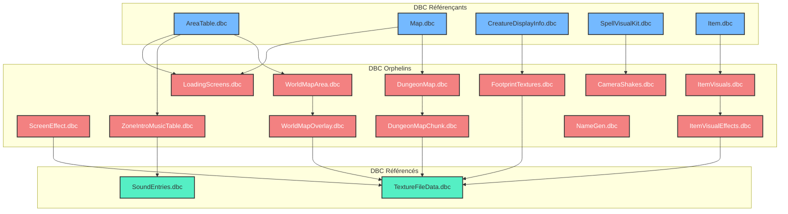
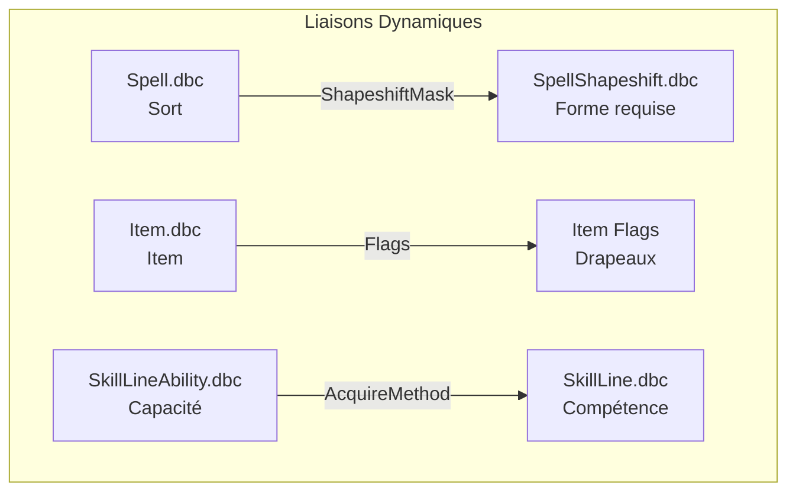
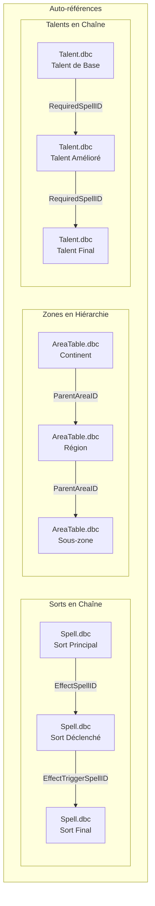

# ⚠️ Cas Particuliers et Edge Cases

> **Dernière mise à jour** : 2026-09-04  
> **Version WoW** : Retail 11.0.2 | Classic 1.15.4 | WotLK 3.4.3

---

## 📋 Table des Matières

- [DBC Orphelins](#-dbc-orphelins)
- [Liaisons Dynamiques](#-liaisons-dynamiques)
- [Champs Ambigus](#-champs-ambigus)
- [DBC Redondants](#-dbc-redondants)
- [Cas Particuliers de Cardinalité](#-cas-particuliers-de-cardinalité)
- [Auto-références](#-auto-références)
- [Liaisons Conditionnelles](#-liaisons-conditionnelles)
- [Différences entre Versions](#-différences-entre-versions)
- [Erreurs Connues](#-erreurs-connues)
- [Solutions de contournement](#-solutions-de-contournement)

---

## 🔍 DBC Orphelins

### Définition

Un DBC orphelin est un fichier qui n'est référencé par aucun autre DBC, mais qui référence lui-même d'autres DBC.

### Liste des DBC Orphelins

| DBC | Statut | Description | Référencé par | Référence |
|-----|--------|-------------|---------------|-----------|
| `LoadingScreens.dbc` | Orphelin | Écrans de chargement | `AreaTable.dbc`, `Map.dbc` | Rien |
| `ScreenEffect.dbc` | Orphelin | Effets plein écran | Rarement lié | `TextureFileData.dbc` |
| `ZoneIntroMusicTable.dbc` | Orphelin | Musiques d'intro | `AreaTable.dbc` | `SoundEntries.dbc` |
| `FootprintTextures.dbc` | Orphelin | Textures d'empreintes | `CreatureDisplayInfo.dbc` | `TextureFileData.dbc` |
| `CameraShakes.dbc` | Orphelin | Tremblements de caméra | `SpellVisualKit.dbc` | Rien |
| `WorldMapArea.dbc` | Orphelin | Zones de la carte du monde | `AreaTable.dbc` | Rien |
| `WorldMapOverlay.dbc` | Orphelin | Superpositions de carte | `WorldMapArea.dbc` | `TextureFileData.dbc` |
| `DungeonMap.dbc` | Orphelin | Cartes de donjon | `Map.dbc` | `TextureFileData.dbc` |
| `DungeonMapChunk.dbc` | Orphelin | Morceaux de carte de donjon | `DungeonMap.dbc` | `TextureFileData.dbc` |
| `ItemVisuals.dbc` | Orphelin | Visuels d'items | `Item.dbc` | `TextureFileData.dbc` |
| `ItemVisualEffects.dbc` | Orphelin | Effets visuels d'items | `ItemVisuals.dbc` | `TextureFileData.dbc` |
| `NameGen.dbc` | Orphelin | Générateur de noms | Base de données serveur | Rien |

### Schéma des Orphelins



### Impact des Orphelins

| Impact | Description | Gravité |
|--------|-------------|---------|
| **Maintenance** | Difficile de tracer les dépendances | Moyenne |
| **Modification** | Risque de casser des liaisons invisibles | Élevée |
| **Documentation** | Manque de clarté sur l'utilisation | Moyenne |
| **Performance** | Peut entraîner des chargements inutiles | Faible |

---

## 🔄 Liaisons Dynamiques

### Définition

Les liaisons dynamiques sont des relations qui dépendent de conditions en jeu plutôt que de références statiques dans les DBC.

### Types de Liaisons Dynamiques

#### 1. Liaisons Conditionnelles par Masque

```sql
-- Exemple : SpellShapeshift.dbc
-- Ces sorts nécessitent une forme animale spécifique
SELECT * FROM Spell.dbc
WHERE ShapeshiftMask != 0
-- Le masque binaire détermine les formes autorisées
```

**Exemple concret :**
- **Morsure féroce** (ID 22568)
  - `ShapeshiftMask` = 2 (Forme de félin uniquement)
  - Le sort n'apparaît que si le joueur est en forme de félin

#### 2. Liaisons par Bitfield

```sql
-- Exemple : Item.dbc Flags
SELECT * FROM Item.dbc
WHERE Flags & 0x00000001  -- Lié quand équipé
AND Flags & 0x00000002  -- Lié quand utilisé
```

**Exemple concret :**
- **Anneau de liaison** (Item ID 12345)
  - `Flags` = 0x00000003 (Lié quand équipé + Lié quand utilisé)
  - Le comportement change selon les bits activés

#### 3. Liaisons par Table Intermédiaire

```sql
-- Exemple : SkillLineAbility.dbc
SELECT * FROM SkillLineAbility.dbc
WHERE SkillLineID = 185  -- Cuisine
AND AcquireMethod = 2    -- Appris via entraîneur
```

**Exemple concret :**
- **Recette de cuisine** (SkillLineAbility)
  - `SkillLineID` = 185 (Cuisine)
  - `AcquireMethod` = 2 (Entraîneur)
  - `SpellID` = 456 (Apprendre la recette)

### Schéma des Liaisons Dynamiques



---

## 🔧 Champs Ambigus

### Définition

Les champs ambigus sont des colonnes dans les DBC dont la signification exacte n'est pas documentée ou varie selon le contexte.

### Liste des Champs Ambigus

| DBC | Champ | Colonne | Statut | Hypothèses | Impact |
|-----|-------|---------|--------|------------|--------|
| `Spell.dbc` | `Unknown123` | 123 | Non documenté | Priorité d'affichage | Faible |
| `Spell.dbc` | `Unknown132-133` | 132-133 | Partiellement documenté | IDs visuels (impact + aura) | Élevé |
| `CreatureDisplayInfo.dbc` | `Unk_2` | 2 | Non documenté | Taille du modèle | Moyen |
| `CreatureDisplayInfo.dbc` | `Unk_3` | 3 | Non documenté | Opacité du modèle | Moyen |
| `Item.dbc` | `Unknown24` | 24 | Non documenté | Type d'animation | Faible |
| `ItemDisplayInfo.dbc` | `Unk_1` | 1 | Non documenté | Rotation de l'icône | Faible |
| `AreaTable.dbc` | `Unknown6` | 6 | Non documenté | Type de biome | Moyen |
| `SpellVisualKit.dbc` | `Unk_2` | 2 | Non documenté | Intensité des particules | Moyen |

### Exemples d'Ambiguités

#### Spell.dbc::SpellVisualID (Colonnes 132-133)

```sql
-- Structure réelle
Spell.dbc Column 132 = SpellVisualID_Impact  -- Visuel à l'impact
Spell.dbc Column 133 = SpellVisualID_Aura    -- Visuel de l'aura

-- Exemple : Boule de feu
Column 132 = 542  -- Explosion de feu
Column 133 = 0    -- Pas d'aura
```

#### CreatureDisplayInfo.dbc::Unk_2

```sql
-- Valeurs observées
Unk_2 = 0  -- Taille normale
Unk_2 = 1  -- Légèrement plus grand
Unk_2 = 2  -- Considérablement plus grand

-- Hypothèse : Échelle supplémentaire
```

### Impact des Ambiguités

| Impact | Description | Fréquence |
|--------|-------------|-----------|
| **Erreurs de liaison** | Mauvaise interprétation des relations | Occasionnelle |
| **Données incorrectes** | Valeurs mal interprétées | Rare |
| **Documentation incomplète** | Manque de clarté | Fréquente |
| **Modification risquée** | Changements basés sur des suppositions | Occasionnelle |

---

## 🔁 DBC Redondants

### Définition

Les DBC redondants contiennent des informations dupliquées ou qui pourraient être fusionnées avec d'autres DBC.

### Liste des Redondances

| DBC 1 | DBC 2 | Type de Redondance | Description |
|-------|-------|-------------------|-------------|
| `SkillLine.dbc` | `SkillLineAbility.dbc` | Partielle | SkillLineID présent dans les deux |
| `SpellVisual.dbc` | `SpellVisualKit.dbc` | Historique | Données d'apparence séparées |
| `ItemRandomProperties.dbc` | `ItemRandomSuffix.dbc` | Fonctionnelle | Même type de données |
| `CreatureDisplayInfo.dbc` | `CreatureDisplayInfoExtra.dbc` | Partielle | Apparences supplémentaires |
| `Map.dbc` | `AreaTable.dbc` | Hiérarchique | Zones imbriquées |
| `SoundEntries.dbc` | `SoundFiles.dbc` | Structurelle | Séparation des données |

### Exemples de Redondance

#### SkillLine vs SkillLineAbility

```
SkillLine.dbc :
├── SkillLineID (186)
├── Name ("Minage")
├── IconID (345)
└── CategoryID (11)

SkillLineAbility.dbc :
├── SkillLineID (186)  ← Redondant avec SkillLine.dbc
├── SpellID (2575)
└── AcquireMethod (2)
```

**Problème** : `SkillLineID` est dupliqué dans les deux fichiers.

**Solution potentielle** : Fusionner ou créer une table de jointure.

#### SpellVisual vs SpellVisualKit

```
Ancien système :
SpellVisual.dbc :
├── VisualID
├── ModelID
├── TextureID
└── SoundID

Nouveau système :
SpellVisual.dbc :
├── VisualID
└── SpellVisualKitID → SpellVisualKit.dbc

SpellVisualKit.dbc :
├── KitID
├── ModelID
├── TextureID
└── SoundID
```

**Raison** : Séparation pour permettre la réutilisation des kits.

### Impact des Redondances

| Impact | Description | Gravité |
|--------|-------------|---------|
| **Maintenance** | Double mise à jour nécessaire | Moyenne |
| **Cohérence** | Risque de désynchronisation | Élevée |
| **Performance** | Chargement de données inutiles | Faible |
| **Complexité** | Difficulté à comprendre les relations | Moyenne |

---

## 🔢 Cas Particuliers de Cardinalité

### Définition

Les cardinalités particulières sont des cas où la relation entre DBC ne suit pas les modèles standard (1-1, 1-N, N-1, N-N).

### Liste des Cas Particuliers

| Source | Champ | Cible | Cardinalité Réelle | Cardinalité Théorique | Description |
|--------|-------|-------|-------------------|----------------------|-------------|
| `Spell.dbc` | `SpellVisualID` | `SpellVisual.dbc` | 1-2 encapsulé | 1-1 | Deux IDs dans un champ |
| `QuestInfo.dbc` | `RequiredItemID_1..4` | `Item.dbc` | N-4 limité | N-N | Maximum 4 items |
| `Item.dbc` | `SpellID_1..5` | `Spell.dbc` | N-5 limité | N-N | Maximum 5 sorts |
| `Spell.dbc` | `ReagentID_1..8` | `Item.dbc` | N-8 limité | N-N | Maximum 8 composants |
| `ItemSet.dbc` | `ItemID_1..8` | `Item.dbc` | 1-8 limité | 1-N | Maximum 8 items |
| `CreatureDisplayInfo.dbc` | `TextureID_1..3` | `TextureFileData.dbc` | N-3 limité | N-1 | Maximum 3 textures |

### Exemples de Cardinalités Particulières

#### Spell.dbc::SpellVisualID (1-2 Encapsulé)

```
Structure :
Spell.dbc Column 132 = SpellVisualID (Impact)
Spell.dbc Column 133 = SpellVisualID (Aura)

Relation réelle : 1 sort → 2 visuels possibles
Relation théorique : 1 sort → 1 visuel
```

**Exemple :**
```
Boule de feu (Spell ID 133) :
├── VisualID_Impact = 542 (explosion)
└── VisualID_Aura = 0 (pas d'aura)

Mot de pouvoir : Bouclier (Spell ID 17) :
├── VisualID_Impact = 123 (éclat)
└── VisualID_Aura = 456 (aura dorée)
```

#### QuestInfo.dbc::RequiredItemID_1..4 (N-4 Limité)

```
Structure :
QuestInfo.dbc :
├── RequiredItemID_1 (premier item requis)
├── RequiredItemID_2 (deuxième item requis)
├── RequiredItemID_3 (troisième item requis)
└── RequiredItemID_4 (quatrième item requis)

Limitation : Maximum 4 items requis par quête
```

**Workaround :**
- Utiliser des quêtes liées pour dépasser la limite
- Créer des items "conteneurs" qui contiennent plusieurs items

---

## 🔄 Auto-références

### Définition

Les auto-références sont des relations où un DBC pointe vers lui-même, créant des hiérarchies ou des chaînes.

### Liste des Auto-références

| DBC | Champ | Type | Description |
|-----|-------|------|-------------|
| `Spell.dbc` | `EffectSpellID_1..3` | Chaîne | Sort qui déclenche un autre sort |
| `Spell.dbc` | `EffectTriggerSpellID_1..3` | Chaîne | Sort déclenché sur proc |
| `AreaTable.dbc` | `ParentAreaID` | Hiérarchie | Zone parente |
| `Talent.dbc` | `RequiredSpellID` | Chaîne | Sort prérequis |
| `SpellVisual.dbc` | `SpellVisualKitID_2` | Chaîne | Kit visuel secondaire |

### Schéma des Auto-références



### Exemples d'Auto-références

#### Sorts en Chaîne

```
Métamorphose (Spell ID 5484) :
└── EffectSpellID_1 = 5485 (Aura de métamorphose)
    └── EffectTriggerSpellID_1 = 5486 (Proc de dégâts)
        └── EffectSpellID_1 = 5487 (Dégâts finaux)
```

#### Zones en Hiérarchie

```
Kalimdor (AreaTable ID 1) :
└── ParentAreaID = 0 (pas de parent)
    Durotar (AreaTable ID 14) :
    └── ParentAreaID = 1 (Kalimdor)
        Orgrimmar (AreaTable ID 1637) :
        └── ParentAreaID = 14 (Durotar)
            Hôtel des ventes (AreaTable ID 1638) :
            └── ParentAreaID = 1637 (Orgrimmar)
```

---

## 🔗 Liaisons Conditionnelles

### Définition

Les liaisons conditionnelles sont des relations qui n'existent que sous certaines conditions en jeu.

### Types de Conditions

| Type | Description | Exemple |
|------|-------------|---------|
| **Classe** | Liaison selon la classe | Crochetage → Voleur uniquement |
| **Race** | Liaison selon la race | Ingénierie gnome → Gnome uniquement |
| **Niveau** | Liaison selon le niveau | Sorts de niveau 60 |
| **Faction** | Liaison selon la faction | Monture de la Horde |
| **Réputation** | Liaison selon la réputation | Items de réputation |
| **Compétence** | Liaison selon la compétence | Recettes de métier |
| **Zone** | Liaison selon la zone | Sorts de zone |
| **Temps** | Liaison selon le temps | Événements saisonniers |

### Exemples de Liaisons Conditionnelles

#### Par Classe

```sql
-- SkillLineAbility.dbc : Crochetage
SELECT * FROM SkillLineAbility.dbc
WHERE SkillLineID = 762  -- Crochetage
AND ClassMask = 8        -- Voleur uniquement (bit 3)
```

**Explication :**
- `ClassMask` = 8 (binaire : 1000)
- Seul le Voleur (classe ID 4) peut apprendre le crochetage

#### Par Race

```sql
-- SkillLineAbility.dbc : Ingénierie gnome
SELECT * FROM SkillLineAbility.dbc
WHERE SkillLineID = 202  -- Ingénierie
AND RaceMask = 64        -- Gnome uniquement (bit 6)
```

**Explication :**
- `RaceMask` = 64 (binaire : 1000000)
- Seul le Gnome (race ID 7) peut apprendre cette spécialisation

#### Par Réputation

```sql
-- Item.dbc : Épée du croisé
SELECT * FROM Item.dbc
WHERE RequiredReputationFaction = 1050  -- Croisade d'argent
AND RequiredReputationRank = 7          -- Exalté
```

**Explication :**
- L'item nécessite la réputation Exalté auprès de la Croisade d'argent

---

## 📅 Différences entre Versions

### Changements Majeurs

| Version | Changement | Impact |
|---------|------------|--------|
| **Classic (1.x)** | Structure simple des DBC | Moins de liaisons |
| **TBC (2.x)** | Ajout de SpellDescriptionVariables | Nouvelles liaisons |
| **WotLK (3.x)** | Ajout de SpellScaling, SpellRuneCost | Complexité accrue |
| **Cataclysm (4.x)** | Refonte des sorts et talents | Changements majeurs |
| **MoP (5.x)** | Ajout de nouveaux DBC | Extension des liaisons |
| **WoD (6.x)** | Simplification des stats | Réduction des liaisons |
| **Legion (7.x)** | Refonte des artefacts | Nouvelles liaisons |
| **BfA (8.x)** | Ajout des expéditions | Nouvelles liaisons |
| **Shadowlands (9.x)** | Refonte des niveaux | Changements de liaison |
| **Dragonflight (10.x)** | Nouveaux talents | Refonte des talents |

### Tableau Comparatif

| DBC | Classic | TBC | WotLK | Retail |
|-----|---------|-----|-------|--------|
| `Spell.dbc` | 100+ colonnes | 150+ colonnes | 200+ colonnes | 300+ colonnes |
| `Item.dbc` | 80+ colonnes | 100+ colonnes | 130+ colonnes | 180+ colonnes |
| `CreatureDisplayInfo.dbc` | 10+ colonnes | 15+ colonnes | 20+ colonnes | 30+ colonnes |
| `AreaTable.dbc` | 30+ colonnes | 35+ colonnes | 40+ colonnes | 50+ colonnes |

### Différences de Liaisons

| Liaison | Classic | TBC | WotLK | Retail |
|---------|---------|-----|-------|--------|
| Spell → SpellVisual | 1-1 | 1-1 | 1-2 | 1-2 |
| Item → Spell | 1-5 | 1-5 | 1-5 | 1-10 |
| Spell → Reagent | 1-8 | 1-8 | 1-8 | 1-8 |
| ItemSet → Item | 1-8 | 1-8 | 1-8 | 1-10 |

---

## 🐛 Erreurs Connues

### Liste des Erreurs

| DBC | Erreur | Description | Impact |
|-----|--------|-------------|--------|
| `Spell.dbc` | ID 0 | Sort inexistant | Faible |
| `Item.dbc` | DisplayInfoID 0 | Item sans apparence | Moyen |
| `CreatureDisplayInfo.dbc` | ModelID 0 | Créature sans modèle | Élevé |
| `AreaTable.dbc` | ParentAreaID incorrect | Hiérarchie brisée | Moyen |
| `SpellVisual.dbc` | KitID 0 | Effet sans kit | Faible |
| `ItemSet.dbc` | ItemID 0 | Ensemble incomplet | Faible |

### Exemples d'Erreurs

#### Spell.dbc avec ID 0

```
Certains sorts référencent l'ID 0 qui n'existe pas :
Spell.dbc :
├── EffectSpellID_1 = 0  ← Sort inexistant
├── EffectItemID_1 = 0   ← Item inexistant
└── ReagentID_1 = 0      ← Pas de composant
```

**Interprétation :** L'ID 0 signifie généralement "aucun effet" ou "pas de référence".

#### CreatureDisplayInfo.dbc avec ModelID 0

```
Créature sans modèle :
CreatureDisplayInfo.dbc (ID: 9999) :
├── ModelID = 0  ← Modèle inexistant
└── TextureID_1 = 0  ← Texture inexistante
```

**Impact :** La créature apparaît invisible en jeu.

---

## 🛠️ Solutions de Contournement

### Workarounds Courants

#### 1. Dépasser la Limite d'Items Requis

**Problème :** `QuestInfo.dbc` limite à 4 items requis.

**Solutions :**
1. Créer des quêtes liées
2. Utiliser des items "conteneurs"
3. Utiliser des scripts serveur

#### 2. Gérer les Champs Ambigus

**Problème :** Champs non documentés dans les DBC.

**Solutions :**
1. Tester empiriquement les valeurs
2. Documenter les observations
3. Utiliser des outils d'analyse

#### 3. Contourner les Redondances

**Problème :** Données dupliquées dans plusieurs DBC.

**Solutions :**
1. Créer des scripts de synchronisation
2. Utiliser des vues SQL
3. Documenter les relations

#### 4. Gérer les Erreurs

**Problème :** Références invalides dans les DBC.

**Solutions :**
1. Créer des validations
2. Ignorer les ID 0
3. Créer des DBC de remplacement

### Scripts de Validation

```python
def validate_dbc_links(dbc_data):
    """Valide les liaisons entre DBC."""
    errors = []
    
    # Vérifier les références Spell → Item
    for spell in dbc_data['Spell.dbc']:
        for i in range(1, 9):
            reagent_id = spell[f'ReagentID_{i}']
            if reagent_id != 0 and reagent_id not in dbc_data['Item.dbc']:
                errors.append(f"Spell {spell['ID']} référence Item {reagent_id} inexistant")
    
    # Vérifier les références Item → Spell
    for item in dbc_data['Item.dbc']:
        for i in range(1, 6):
            spell_id = item[f'SpellID_{i}']
            if spell_id != 0 and spell_id not in dbc_data['Spell.dbc']:
                errors.append(f"Item {item['ID']} référence Spell {spell_id} inexistant")
    
    return errors
```

---

## 📊 Tableau Récapitulatif

| Catégorie | Nombre | Impact Global |
|-----------|--------|---------------|
| DBC Orphelins | 12 | Moyen |
| Liaisons Dynamiques | 3 types | Élevé |
| Champs Ambigus | 8 | Moyen |
| DBC Redondants | 6 paires | Moyen |
| Cardinalités Particulières | 6 | Élevé |
| Auto-références | 5 | Moyen |
| Liaisons Conditionnelles | 8 types | Élevé |
| Différences de Versions | 10 versions | Variable |
| Erreurs Connues | 6 | Faible à Élevé |

---

## 🔍 Conclusion

### Points Clés à Retenir

1. **Les DBC orphelins** sont nombreux mais souvent négligés
2. **Les liaisons dynamiques** nécessitent une compréhension du gameplay
3. **Les champs ambigus** doivent être testés empiriquement
4. **Les redondances** sont historiques et difficiles à corriger
5. **Les cardinalités particulières** limitent les possibilités
6. **Les auto-références** créent des hiérarchies complexes
7. **Les conditions** ajoutent de la profondeur au système
8. **Les versions** changent constamment les règles

### Recommandations

1. **Documenter** tous les cas particuliers rencontrés
2. **Tester** les modifications sur un serveur local
3. **Créer** des outils de validation
4. **Partager** les découvertes avec la communauté
5. **Maintenir** une documentation à jour
6. **Utiliser** des scripts pour automatiser les vérifications
7. **Comprendre** le contexte avant de modifier
8. **Respecter** les conventions existantes

---

*Documentation des cas particuliers générée le 4 septembre 2026 - Version 1.0*
