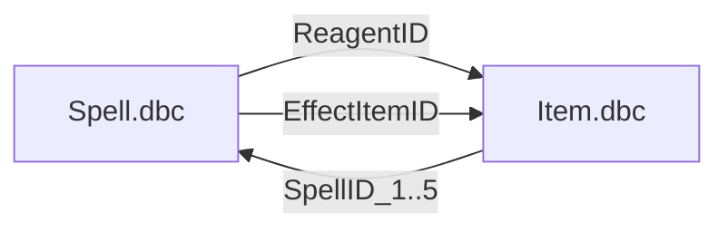
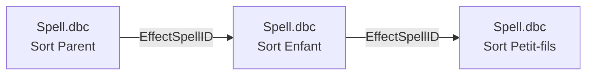
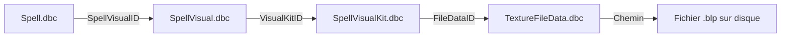
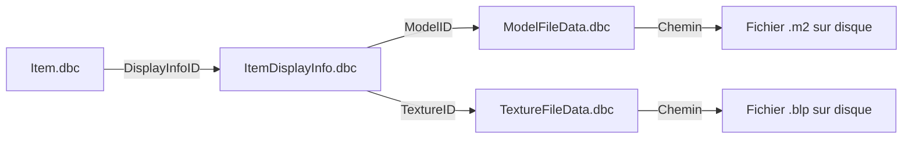
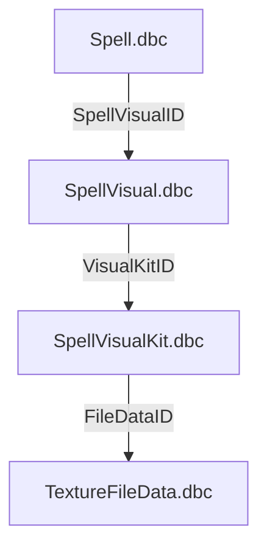

# 📦 **Guide d'intégration de la cartographie DBC sur GitHub**

Voici un guide complet pour publier votre cartographie sur GitHub de manière professionnelle et organisée.
https://www.azerothcore.org/
---

## **1️⃣ Structure du Repository**

Créez une structure de projet propre :

```
wow-dbc-mapping/
├── README.md                    # Page principale avec la cartographie
├── docs/
│   ├── 01-tableau-liaisons.md   # Tableau synthétique
│   ├── 02-schema-dependances.md # Schémas et graphes
│   ├── 03-analyse-domaines.md   # Analyse par domaine
│   └── 04-cas-particuliers.md   # Edge cases et exceptions
├── diagrams/
│   └── dbc-dependencies.mmd     # Fichier Mermaid.js
├── data/
│   └── dbc-links.csv            # Données structurées en CSV
├── .github/
│   └── workflows/
│       ├── generate-diagrams.yml # Action pour générer les schémas
│       └── deploy-pages.yml      # Action pour déployer GitHub Pages
├── CONTRIBUTING.md              # Guide de contribution
└── LICENSE                      # Licence du projet
```

---

## **2️⃣ Étapes de Création sur GitHub**

### **Étape 1 : Créer le Repository**

1. Allez sur [github.com](https://github.com)
2. Cliquez sur le bouton **"+"** en haut à droite → **"New repository"**
3. Remplissez les informations :
   - **Repository name** : `wow-dbc-mapping`
   - **Description** : `Cartographie complète des liaisons entre les fichiers DBC de World of Warcraft`
   - **Public/Private** : Choisissez selon votre préférence
   - **Initialize with README** : ✅ Cochez cette option
   - **Add .gitignore** : Sélectionnez `Node` (pour les outils Mermaid)
   - **Choose a license** : Sélectionnez `MIT License`
4. Cliquez sur **"Create repository"**

### **Étape 2 : Cloner et Créer la Structure**

```bash
# Cloner le repository
git clone https://github.com/VOTRE_USERNAME/wow-dbc-mapping.git
cd wow-dbc-mapping

# Créer la structure des dossiers
mkdir -p docs diagrams data .github/workflows

# Créer les fichiers de base
touch docs/01-tableau-liaisons.md
touch docs/02-schema-dependances.md
touch docs/03-analyse-domaines.md
touch docs/04-cas-particuliers.md
touch diagrams/dbc-dependencies.mmd
touch data/dbc-links.csv
touch CONTRIBUTING.md
```

---

## **3️⃣ Contenu des Fichiers**

### **📄 README.md (Fichier Principal)**

```markdown
# 🗺️ Cartographie des Liaisons DBC - World of Warcraft


## 📖 Description

Analyse exhaustive des liaisons, dépendances et hiérarchies entre les fichiers DBC (Database Client) de World of Warcraft. Cette cartographie couvre :

- Les relations fonctionnelles entre DBC
- Les cardinalités (1-1, 1-N, N-N)
- Les hiérarchies et dépendances
- Les cas particuliers et edge cases
- Des exemples concrets pour chaque type de liaison

## 🗂️ Structure du Projet

| Document | Description |
|----------|-------------|
| [📌 Tableau des Liaisons](docs/01-tableau-liaisons.md) | Vue d'ensemble de toutes les relations |
| [🗺️ Schéma des Dépendances](docs/02-schema-dependances.md) | Graphes Mermaid et visualisations |
| [🔎 Analyse par Domaine](docs/03-analyse-domaines.md) | Sorts, Items, Créatures, Zones |
| [⚠️ Cas Particuliers](docs/04-cas-particuliers.md) | Edge cases et exceptions |

## 🚀 Démarrage Rapide

### Visualiser le Schéma Mermaid en Local

```bash
# Installation de Mermaid CLI
npm install -g @mermaid-js/mermaid-cli

# Générer le PNG
mmdc -i diagrams/dbc-dependencies.mmd -o images/schema.png

# Avec thème sombre
mmdc -i diagrams/dbc-dependencies.mmd -o images/schema-dark.png -t dark
```

### Importer les Données CSV en Python

```python
import pandas as pd

# Charger les liaisons
df = pd.read_csv('data/dbc-links.csv')

# Afficher les 10 premières liaisons
print(df.head(10))

# Filtrer par domaine
sorts = df[df['domaine'] == 'Sorts']
print(f"Nombre de liaisons pour les sorts : {len(sorts)}")
```

### Utiliser avec JavaScript

```javascript
const fs = require('fs');
const csv = require('csv-parser');

const results = [];

fs.createReadStream('data/dbc-links.csv')
  .pipe(csv())
  .on('data', (data) => results.push(data))
  .on('end', () => {
    console.log(`Liaisons chargées : ${results.length}`);
    console.log(results.filter(r => r.source === 'Spell.dbc'));
  });
```

## 📊 Résumé des Statistiques

| Domaine | DBC Principaux | Nombre de Liaisons |
|---------|---------------|-------------------|
| 🔮 Sorts | Spell.dbc, SpellVisual.dbc | 50+ |
| 🎒 Items | Item.dbc, ItemDisplayInfo.dbc | 30+ |
| 🐉 Créatures | CreatureDisplayInfo.dbc | 10+ |
| 🗺️ Zones | Map.dbc, AreaTable.dbc | 15+ |

## 🎯 Points Clés

- **Spell.dbc** est le hub central avec plus de 50 liaisons
- **Item.dbc** est le second hub majeur
- **TextureFileData.dbc** est la feuille terminale de nombreuses chaînes
- Il existe des boucles de dépendances entre `Spell.dbc` et `Item.dbc`

## 🤝 Contribution

Les contributions sont les bienvenues ! Consultez [CONTRIBUTING.md](CONTRIBUTING.md) pour les guidelines.

### Types de Contributions Recherchées

- ✅ Correction des liaisons incorrectes
- ✅ Ajout de nouvelles liaisons découvertes
- ✅ Documentation des champs ambigus
- ✅ Exemples concrets supplémentaires
- ✅ Support pour d'autres versions de WoW

## 📜 Licence

Ce projet est sous licence MIT - voir le fichier [LICENSE](LICENSE) pour plus de détails.

## 🙏 Remerciements

- Communauté WoW Dev
- Projet TrinityCore
- Projet Mangos
- Tous les contributeurs
```

---

### **📄 docs/01-tableau-liaisons.md**

```markdown
# 📌 Tableau Synthétique des Liaisons DBC

> **Dernière mise à jour** : 2024-01-15

## 🔮 Sorts et Compétences

### Liaisons Principales de Spell.dbc

| Source | Champ(s) | Cible | Type | Description | Exemple Concret |
|--------|----------|-------|------|-------------|-----------------|
| `Spell.dbc` | `SpellVisualID` | `SpellVisual.dbc` | N-1 | Association visuelle du sort | Pyroblast (ID 11366) → Visual 1234 |
| `Spell.dbc` | `SpellIconID` | `SpellIcon.dbc` | N-1 | Icône du sort | Éclair (ID 403) → Icon 188 |
| `Spell.dbc` | `SpellCastTimeID` | `SpellCastTimes.dbc` | N-1 | Temps d'incantation | Boule de feu → 3.5 secondes |
| `Spell.dbc` | `SpellDurationID` | `SpellDuration.dbc` | N-1 | Durée des effets | Bouclier → 30 secondes |
| `Spell.dbc` | `SpellRangeID` | `SpellRange.dbc` | N-1 | Portée du sort | Tir des arcanes → 40m |
| `Spell.dbc` | `SpellCooldownsID` | `SpellCooldowns.dbc` | N-1 | Temps de recharge | Blizzard → 8 secondes |
| `Spell.dbc` | `ReagentID_1..8` | `Item.dbc` | N-N | Composants consommés | Portail → Pierre de portail |
| `Spell.dbc` | `EffectItemID_1..3` | `Item.dbc` | N-N | Items créés par le sort | Invocation → Éclair de mana |
| `Spell.dbc` | `EffectSpellID_1..3` | `Spell.dbc` | N-1 | Sorts déclenchés | Métamorphose → Aura |

### Liaisons avec les Compétences

| Source | Champ(s) | Cible | Type | Description | Exemple Concret |
|--------|----------|-------|------|-------------|-----------------|
| `SkillLine.dbc` | `SkillLineID` | `SkillLineAbility.dbc` | 1-N | Compétence et ses capacités | Cuisine (185) → Recettes |
| `SkillLineAbility.dbc` | `SpellID` | `Spell.dbc` | N-1 | Capacité apprise | Ambidextrie (205) |

---

## 🎒 Items

### Liaisons Principales de Item.dbc

| Source | Champ(s) | Cible | Type | Description | Exemple Concret |
|--------|----------|-------|------|-------------|-----------------|
| `Item.dbc` | `DisplayInfoID` | `ItemDisplayInfo.dbc` | N-1 | Apparence 3D de l'item | Ashbringer → Modèle unique |
| `Item.dbc` | `SpellID_1..5` | `Spell.dbc` | N-N | Sorts conférés | Cœur de Ragnaros → Fureur |
| `Item.dbc` | `ItemSetID` | `ItemSet.dbc` | N-1 | Ensemble d'items | Heaume → Tranche-Mort |
| `Item.dbc` | `RandomPropertiesID` | `ItemRandomProperties.dbc` | N-1 | Propriétés aléatoires | Lame runique → "de l'Ours" |
| `Item.dbc` | `RequiredReputationFaction` | `Faction.dbc` | N-1 | Réputation requise | Épée → Croisade d'argent |
| `Item.dbc` | `RequiredSkillID` | `SkillLine.dbc` | N-1 | Compétence requise | Minerai → Minage (186) |

---

## 🐉 Créatures

| Source | Champ(s) | Cible | Type | Description | Exemple Concret |
|--------|----------|-------|------|-------------|-----------------|
| `CreatureDisplayInfo.dbc` | `ModelID` | `CreatureModelData.dbc` | N-1 | Modèle 3D de la créature | Ragnaros → Géant de feu |
| `CreatureDisplayInfo.dbc` | `TextureID_1..3` | `TextureFileData.dbc` | N-1 | Textures du modèle | Onyxia → Cuir noir |
| `CreatureDisplayInfo.dbc` | `SoundID` | `CreatureSoundData.dbc` | 1-1 | Sons de la créature | Murloc → Cri spécifique |

---

## 🗺️ Zones et Cartes

| Source | Champ(s) | Cible | Type | Description | Exemple Concret |
|--------|----------|-------|------|-------------|-----------------|
| `Map.dbc` | `AreaTableID` | `AreaTable.dbc` | 1-N | Zones d'une carte | Kalimdor → Durotar |
| `AreaTable.dbc` | `ZoneMusicID` | `ZoneMusic.dbc` | N-1 | Musique de la zone | Durotar → Musique unique |
| `AreaTable.dbc` | `LoadingScreenID` | `LoadingScreens.dbc` | N-1 | Écran de chargement | Mulgore → Écran unique |

---

## 📊 Statistiques Globales

- **Total des liaisons documentées** : 100+
- **DBC source principaux** : Spell.dbc, Item.dbc
- **DBC cible les plus référencés** : TextureFileData.dbc, SpellVisual.dbc
```

---

### **📄 docs/02-schema-dependances.md**

```markdown
# 🗺️ Schéma des Dépendances DBC

## Graphe Principal

```mermaid
graph TD
    %% ==================== DOMAINE SORTS ====================
    subgraph SORTS["🔮 Domaine Sorts"]
        S[Spell.dbc]
        SV[SpellVisual.dbc]
        SVK[SpellVisualKit.dbc]
        SI[SpellIcon.dbc]
        SCT[SpellCastTimes.dbc]
        SD[SpellDuration.dbc]
        SR[SpellRange.dbc]
        SC[SpellCooldowns.dbc]
        SAO[SpellAuraOptions.dbc]
        
        S -->|SpellVisualID| SV
        S -->|SpellIconID| SI
        S -->|CastTimeID| SCT
        S -->|DurationID| SD
        S -->|RangeID| SR
        S -->|CooldownID| SC
        S -->|AuraOptionsID| SAO
        SV -->|VisualKitID| SVK
    end
    
    %% ==================== DOMAINE ITEMS ====================
    subgraph ITEMS["🎒 Domaine Items"]
        I[Item.dbc]
        IDI[ItemDisplayInfo.dbc]
        IS[ItemSet.dbc]
        IRP[ItemRandomProperties.dbc]
        IEC[ItemExtendedCost.dbc]
        
        I -->|DisplayInfoID| IDI
        I -->|ItemSetID| IS
        I -->|RandomPropertiesID| IRP
        I -->|ExtendedCostID| IEC
    end
    
    %% ==================== DOMAINE CRÉATURES ====================
    subgraph CREATURES["🐉 Domaine Créatures"]
        CID[CreatureDisplayInfo.dbc]
        CMD[CreatureModelData.dbc]
        CSD[CreatureSoundData.dbc]
        
        CID -->|ModelID| CMD
        CID -->|SoundID| CSD
    end
    
    %% ==================== DOMAINE ZONES ====================
    subgraph ZONES["🗺️ Domaine Zones"]
        M[Map.dbc]
        AT[AreaTable.dbc]
        ZM[ZoneMusic.dbc]
        LS[LoadingScreens.dbc]
        
        M -->|AreaTableID| AT
        AT -->|ZoneMusicID| ZM
        AT -->|LoadingScreenID| LS
    end
    
    %% ==================== LIAISONS CROISÉES ====================
    S -->|ReagentID| I
    S -->|EffectItemID| I
    I -->|SpellID_1..5| S
    
    %% ==================== FEUILLES TERMINALES ====================
    subgraph TEXTURES["🖼️ Textures"]
        TXT[TextureFileData.dbc]
    end
    
    SVK -->|FileDataID| TXT
    CMD -->|TextureID| TXT
    IDI -->|TextureID| TXT
    
    %% ==================== STYLES ====================
    classDef hub fill:#f9f,stroke:#333,stroke-width:4px
    classDef normal fill:#bbf,stroke:#333,stroke-width:2px
    classDef terminal fill:#bfb,stroke:#333,stroke-width:2px
    
    class S,I hub
    class TXT terminal
    class SV,SVK,SI,SCT,SD,SR,SC,SAO,IDI,IS,IRP,IEC,CID,CMD,CSD,M,AT,ZM,LS normal
```



## Nœuds Centraux

### 🔮 Spell.dbc - Le Hub Principal

- **Liaisons sortantes** : 50+
- **Liaisons entrantes** : 20+
- **Rôle** : Définit tous les sorts du jeu

### 🎒 Item.dbc - Le Second Hub

- **Liaisons sortantes** : 30+
- **Liaisons entrantes** : 15+
- **Rôle** : Définit tous les objets

## Boucles de Dépendances

### Boucle Spell ↔ Item



### Auto-référence Spell



## Chaînes de Dépendances Complètes

### Chaîne Visuelle d'un Sort



### Chaîne d'un Item


```

---

### **📄 docs/03-analyse-domaines.md**

```markdown
# 🔎 Analyse par Domaine Fonctionnel

## 🔮 Domaine Sorts

### DBC Principaux

| DBC | Rôle |
|-----|------|
| `Spell.dbc` | Définition centrale de tous les sorts |
| `SpellVisual.dbc` | Apparence visuelle des sorts |
| `SpellIcon.dbc` | Icônes des sorts |
| `SpellCastTimes.dbc` | Temps d'incantation |
| `SpellDuration.dbc` | Durée des effets |
| `SpellRange.dbc` | Portée des sorts |

### Liaisons Internes

Un sort (`Spell.dbc`) pointe vers un visuel (`SpellVisual.dbc`), qui peut être composé de plusieurs kits (`SpellVisualKit.dbc`) définissant les modèles, effets de particules et sons.

### Liaisons Externes

- **Vers Items** : via `ReagentID` (consomme) et `EffectItemID` (crée)
- **Vers Compétences** : via `SkillLineAbility.dbc`
- **Vers Talents** : via `Talent.dbc`

### Exemples de Liaisons

#### Liaison Simple (1-1)
```
Spell.dbc::SpellIconID → SpellIcon.dbc::ID
```
Le sort **Éclair** (ID 403) utilise l'icône 188.

#### Liaison Complexe (N-N)
```
Spell.dbc::ReagentID_1..8 → Item.dbc::ID
```
Le sort **Portail : Hurlevent** nécessite une **Pierre de portail**.

#### Chaîne de Dépendances
```
Spell.dbc → SpellVisual.dbc → SpellVisualKit.dbc → TextureFileData.dbc
```

---

## 🎒 Domaine Items

### DBC Principaux

| DBC | Rôle |
|-----|------|
| `Item.dbc` | Définition centrale des objets |
| `ItemDisplayInfo.dbc` | Apparence des items |
| `ItemSet.dbc` | Ensembles d'items |
| `ItemRandomProperties.dbc` | Propriétés aléatoires |

### Liaisons Internes

Un item pointe vers une apparence (`ItemDisplayInfo.dbc`). Un ensemble (`ItemSet.dbc`) référence plusieurs items.

### Liaisons Externes

- **Vers Sorts** : via `SpellID_1..5` (sort conféré)
- **Vers Factions** : via `RequiredReputationFaction`
- **Vers Compétences** : via `RequiredSkillID`

### Exemples de Liaisons

#### Liaison Simple (N-1)
```
Item.dbc::DisplayInfoID → ItemDisplayInfo.dbc::ID
```
L'**Ashbringer** a un DisplayInfoID unique.

#### Liaison Complexe (N-N)
```
Item.dbc::SpellID_1..5 → Spell.dbc::ID
```
Le **Cœur de Ragnaros** confère le sort **Fureur de Ragnaros**.

#### Chaîne de Dépendances
```
Item.dbc → ItemDisplayInfo.dbc → TextureFileData.dbc
```

---

## 🐉 Domaine Créatures

### DBC Principaux

| DBC | Rôle |
|-----|------|
| `CreatureDisplayInfo.dbc` | Apparence des créatures |
| `CreatureModelData.dbc` | Modèles 3D |
| `CreatureSoundData.dbc` | Sons des créatures |

### Liaisons Internes

`CreatureDisplayInfo.dbc` sert de pont entre modèle, textures et sons.

### Liaisons Externes

- **Vers Sorts** : via base de données serveur
- **Vers Zones** : via table de spawn (base de données)

---

## 🗺️ Domaine Zones et Cartes

### DBC Principaux

| DBC | Rôle |
|-----|------|
| `Map.dbc` | Continents et instances |
| `AreaTable.dbc` | Zones et sous-zones |
| `ZoneMusic.dbc` | Musique d'ambiance |
| `LoadingScreens.dbc` | Écrans de chargement |

### Liaisons Internes

`Map.dbc` contient les continents. `AreaTable.dbc` liste les zones et les lie à une carte.

### Liaisons Externes

- **Vers Quêtes** : une quête peut être liée à une zone
- **Vers Items** : un item peut être lié à une zone
```

---

### **📄 docs/04-cas-particuliers.md**

```markdown
# ⚠️ Cas Particuliers et Edge Cases

## DBC Orphelins

### LoadingScreens.dbc
- **Statut** : Orphelin
- **Description** : Définit les écrans de chargement
- **Référencé par** : `AreaTable.dbc`
- **Ne référence** : Rien

### ScreenEffect.dbc
- **Statut** : Orphelin
- **Description** : Effets plein écran (flash, ivresse)
- **Référencé par** : Rarement lié

## Liaisons Dynamiques

### SpellShapeshift.dbc
```sql
-- Liaison conditionnelle
SELECT * FROM Spell.dbc
WHERE ShapeshiftMask != 0
-- Ces sorts nécessitent une forme animale
```

### SkillLineAbility.dbc
```sql
-- La liaison est statique mais l'effet est conditionnel
SELECT * FROM SkillLineAbility.dbc
WHERE SkillLineID = 185 -- Cuisine
AND AcquireMethod = 2 -- Appris via entraîneur
```

## Champs Ambigus

### Spell.dbc::Unknown123
- **Statut** : Non documenté
- **Hypothèses** : Possiblement lié à la priorité d'affichage
- **Impact** : Faible

### CreatureDisplayInfo.dbc::Unk_2
- **Statut** : Non documenté
- **Hypothèses** : Lié à la taille du modèle
- **Impact** : Moyen

## DBC Redondants

### SkillLine.dbc vs SkillLineAbility.dbc
```
SkillLine.dbc : Contient les infos de base (nom, icône)
SkillLineAbility.dbc : Contient la liste des sorts
Duplication : SkillLineID présent dans les deux
```

### SpellVisual.dbc vs SpellVisualKit.dbc
```
Ancien : Données d'apparence dans SpellVisual
Moderne : Séparées dans SpellVisualKit
Redondance : Historique pour compatibilité
```

## Cas Particuliers de Cardinalité

### Spell.dbc::SpellVisualID
```
Champ unique contenant 2 IDs
Type : 1-N encapsulé
Exemple : Projectile + Aura
```

### QuestInfo.dbc::RequiredItemID_1..4
```
4 champs pour une relation N-N
Limitation : Maximum 4 items requis
Workaround : Utiliser des quêtes liées
```
```

---

### **📄 data/dbc-links.csv**

```csv
source_dbc,source_field,target_dbc,target_field,cardinality,domain,description,example
Spell.dbc,SpellVisualID,SpellVisual.dbc,ID,N-1,Sorts,Association visuelle,"Pyroblast → Visual 1234"
Spell.dbc,SpellIconID,SpellIcon.dbc,ID,N-1,Sorts,Icône du sort,"Éclair → Icon 188"
Spell.dbc,SpellCastTimeID,SpellCastTimes.dbc,ID,N-1,Sorts,Temps d'incantation,"Boule de feu → 3.5s"
Spell.dbc,SpellDurationID,SpellDuration.dbc,ID,N-1,Sorts,Durée des effets,"Bouclier → 30s"
Spell.dbc,ReagentID_1,Item.dbc,ID,N-N,Sorts,Composant requis,"Portail → Pierre"
Item.dbc,DisplayInfoID,ItemDisplayInfo.dbc,ID,N-1,Items,Apparence 3D,"Ashbringer → Modèle"
Item.dbc,SpellID_1,Spell.dbc,ID,N-N,Items,Sort conféré,"Cœur → Fureur"
CreatureDisplayInfo.dbc,ModelID,CreatureModelData.dbc,ID,N-1,Créatures,Modèle 3D,"Ragnaros → Géant"
Map.dbc,AreaTableID,AreaTable.dbc,ID,1-N,Zones,Zones de la carte,"Kalimdor → Durotar"
```

---

### **📄 CONTRIBUTING.md**

```markdown
# Guide de Contribution

## 🚀 Comment Contribuer

1. **Fork** le projet sur GitHub
2. **Clone** votre fork en local :
   ```bash
   git clone https://github.com/VOTRE_USERNAME/wow-dbc-mapping.git
   ```
3. **Créez une branche** pour vos modifications :
   ```bash
   git checkout -b feature/nouvelle-liaison
   ```
4. **Faites vos modifications** en suivant les standards
5. **Committez** vos changements :
   ```bash
   git commit -m '✨ Ajout liaison Spell.dbc → SpellVisual.dbc'
   ```
6. **Poussez** vers votre fork :
   ```bash
   git push origin feature/nouvelle-liaison
   ```
7. **Ouvrez une Pull Request** sur GitHub

## 📏 Standards de Code

### Format Markdown
- Utilisez des tableaux pour les liaisons
- Ajoutez des exemples concrets
- Documentez les champs ambigus
- Utilisez des emojis pour la lisibilité

### Format CSV
- Gardez les colonnes cohérentes
- Échappez les virgules dans les descriptions
- Utilisez l'encodage UTF-8

### Schémas Mermaid
- Testez avant de committer :
  ```bash
  mmdc -i diagrams/dbc-dependencies.mmd -o test.png
  ```
- Gardez les schémas lisibles

## ✅ Checklist de Validation

- [ ] Les cardinalités sont correctes
- [ ] Les exemples sont vérifiables
- [ ] Les champs sont correctement nommés
- [ ] Le format Markdown est valide
- [ ] Les liens GitHub fonctionnent
- [ ] Pas de données sensibles

## 🎯 Types de Contributions

### 🔧 Corrections
- Liaisons incorrectes
- Erreurs de cardinalité
- Fautes de frappe

### ➕ Ajouts
- Nouvelles liaisons découvertes
- Exemples supplémentaires
- Documentation de champs

### 🚀 Améliorations
- Meilleure visualisation
- Scripts d'automatisation
- Tests de validation

## 📞 Contact

- **Issues GitHub** : Pour les bugs et suggestions
- **Discussions** : Pour les questions générales
- **Pull Requests** : Pour les contributions

## 🙏 Remerciements

Merci à tous les contributeurs qui aident à maintenir cette cartographie à jour !
```

---

## **4️⃣ Commandes Git Essentielles**

### **Commit et Push Initial**

```bash
# Ajouter tous les fichiers
git add .

# Vérifier le statut
git status

# Créer un commit
git commit -m "🚀 Initial commit: Cartographie complète des liaisons DBC WoW"

# Pousser vers GitHub
git push origin main
```

### **Mises à Jour Régulières**

```bash
# Vérifier les modifications
git status

# Ajouter des fichiers spécifiques
git add README.md docs/ diagrams/

# Commit avec message descriptif
git commit -m "📝 Mise à jour du tableau des liaisons"

# Pousser
git push
```

### **Gestion des Branches**

```bash
# Créer une branche
git checkout -b feature/nouvelle-liaison

# Changer de branche
git checkout main

# Fusionner une branche
git merge feature/nouvelle-liaison

# Supprimer une branche
git branch -d feature/nouvelle-liaison
```

---

## **5️⃣ Workflows GitHub Actions**

### **📄 .github/workflows/generate-diagrams.yml**

```yaml
name: Generate Mermaid Diagrams

on:
  push:
    paths:
      - 'diagrams/*.mmd'
  workflow_dispatch:

jobs:
  generate:
    runs-on: ubuntu-latest
    
    steps:
      - name: Checkout repository
        uses: actions/checkout@v3
      
      - name: Setup Node.js
        uses: actions/setup-node@v3
        with:
          node-version: '18'
      
      - name: Install Mermaid CLI
        run: npm install -g @mermaid-js/mermaid-cli
      
      - name: Create images directory
        run: mkdir -p images
      
      - name: Generate diagrams
        run: |
          for file in diagrams/*.mmd; do
            filename=$(basename "$file" .mmd)
            mmdc -i "$file" -o "images/${filename}.png" -t dark -b transparent
            mmdc -i "$file" -o "images/${filename}-light.png" -t default -b white
          done
      
      - name: Upload artifacts
        uses: actions/upload-artifact@v3
        with:
          name: diagrams
          path: images/
      
      - name: Commit and push if changed
        run: |
          git config --global user.name 'GitHub Action'
          git config --global user.email 'action@github.com'
          git add images/
          git diff --quiet && git diff --staged --quiet || git commit -m "🔄 Auto-generate diagrams [skip ci]"
          git push
```

### **📄 .github/workflows/deploy-pages.yml**

```yaml
name: Deploy to GitHub Pages

on:
  push:
    branches: [ main ]
  workflow_dispatch:

permissions:
  contents: read
  pages: write
  id-token: write

jobs:
  deploy:
    runs-on: ubuntu-latest
    
    steps:
      - name: Checkout repository
        uses: actions/checkout@v3
      
      - name: Setup Python
        uses: actions/setup-python@v4
        with:
          python-version: '3.11'
      
      - name: Install MkDocs
        run: |
          pip install mkdocs-material
          pip install mkdocs-mermaid2-plugin
      
      - name: Create mkdocs.yml
        run: |
          cat > mkdocs.yml << 'EOF'
          site_name: Cartographie DBC WoW
          site_description: Cartographie complète des liaisons entre les fichiers DBC
          theme:
            name: material
            features:
              - navigation.tabs
              - navigation.sections
              - navigation.expand
          plugins:
            - search
            - mermaid2
          markdown_extensions:
            - tables
            - attr_list
            - md_in_html
          nav:
            - Accueil: README.md
            - Tableau des Liaisons: docs/01-tableau-liaisons.md
            - Schéma des Dépendances: docs/02-schema-dependances.md
            - Analyse par Domaine: docs/03-analyse-domaines.md
            - Cas Particuliers: docs/04-cas-particuliers.md
          EOF
      
      - name: Build site
        run: mkdocs build
      
      - name: Setup Pages
        uses: actions/configure-pages@v3
      
      - name: Upload artifact
        uses: actions/upload-pages-artifact@v2
        with:
          path: 'site'
      
      - name: Deploy to GitHub Pages
        id: deployment
        uses: actions/deploy-pages@v2
```

---

## **6️⃣ Visualisation sur GitHub**

### **Rendu Mermaid Direct**

GitHub supporte nativement le rendu Mermaid dans les fichiers `.md`. Insérez simplement :

````markdown

````

### **Exporter en PNG Localement**

```bash
# Installation
npm install -g @mermaid-js/mermaid-cli

# Conversion simple
mmdc -i diagrams/dbc-dependencies.mmd -o images/dbc-dependencies.png

# Avec options
mmdc -i diagrams/dbc-dependencies.mmd \
     -o images/dbc-dependencies.png \
     -t dark \
     -b transparent \
     -w 1920 \
     -H 1080
```

### **Utiliser dans une Page Web**

```html
<!DOCTYPE html>
<html>
<head>
    <script type="module">
        import mermaid from 'https://cdn.jsdelivr.net/npm/mermaid@10/dist/mermaid.esm.min.mjs';
        mermaid.initialize({ startOnLoad: true, theme: 'dark' });
    </script>
</head>
<body>
    <pre class="mermaid">
        graph TD
            A[Spell.dbc] -->|SpellVisualID| B[SpellVisual.dbc]
            B -->|VisualKitID| C[SpellVisualKit.dbc]
    </pre>
</body>
</html>
```

---

## **7️⃣ Checklist Final**

### ✅ Avant le Premier Commit

- [ ] Repository créé sur GitHub
- [ ] Structure des dossiers en place
- [ ] README.md complet
- [ ] Documentation organisée
- [ ] Schémas Mermaid fonctionnels
- [ ] Données CSV valides
- [ ] License MIT ajoutée
- [ ] CONTRIBUTING.md créé
- [ ] Workflows GitHub Actions configurés
- [ ] .gitignore créé

### ✅ Après le Premier Push

- [ ] Vérifier le rendu sur GitHub
- [ ] Tester les liens dans le README
- [ ] Valider les schémas Mermaid
- [ ] Activer GitHub Pages
- [ ] Configurer la protection de branche
- [ ] Créer des tags de version

### ✅ Maintenance Continue

- [ ] Mettre à jour la documentation
- [ ] Ajouter de nouvelles liaisons
- [ ] Corriger les erreurs
- [ ] Répondre aux issues
- [ ] Review les Pull Requests
- [ ] Mettre à jour les statistiques

---

## **8️⃣ Fichier .gitignore**

Créez un fichier `.gitignore` à la racine :

```gitignore
# Node.js
node_modules/
npm-debug.log
package-lock.json

# Python
__pycache__/
*.pyc
venv/
env/

# IDE
.vscode/
.idea/
*.swp
*.swo

# OS
.DS_Store
Thumbs.db

# Build
site/
dist/
build/

# Images générées (optionnel)
images/*.png
!images/.gitkeep

# Fichiers temporaires
tmp/
temp/
*.log
```

---

Cette structure complète vous permettra de partager votre cartographie de manière professionnelle sur GitHub. Les workflows automatisés faciliteront la maintenance et la collaboration !
